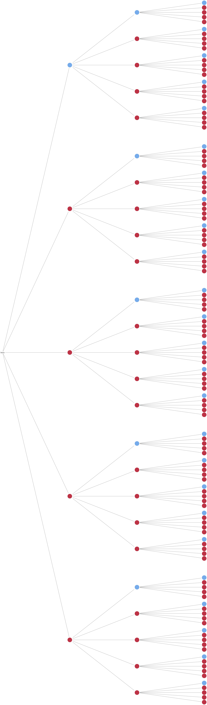
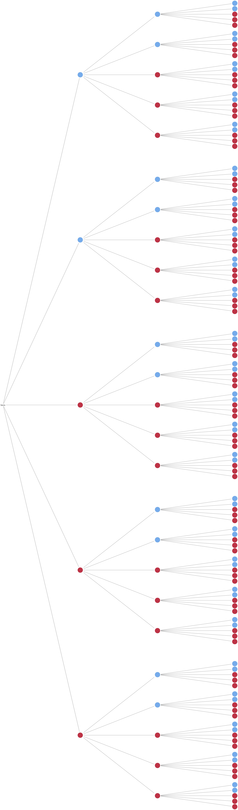
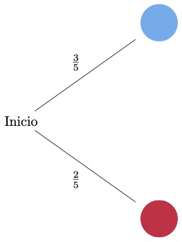
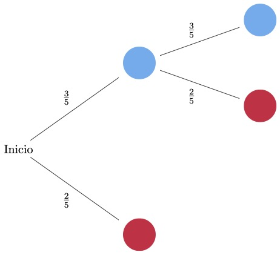
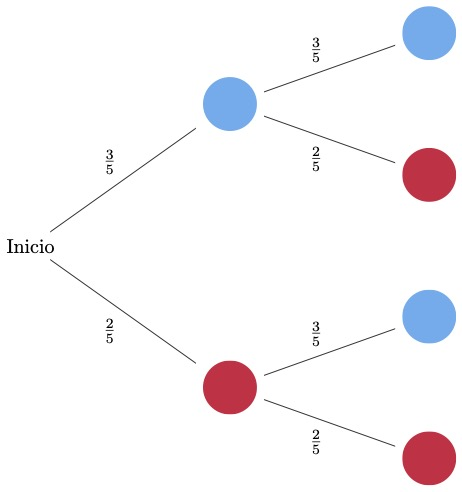
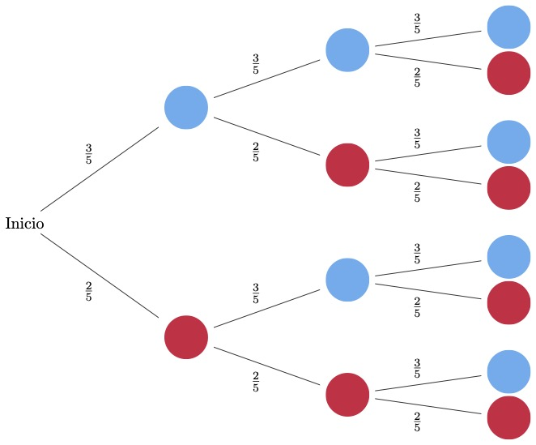

# Introducción {#intro}

## Estadística y muestras

La [enciclopedia Stanford de filosofía](https://plato.stanford.edu/entries/statistics/#StaInd) establece la siguiente definición de estadística^[Traducción y subrayado de Rodrigo].

```{block, type = "Definicion"}
**Estadística**
La estadística es una disciplina matemática y conceptual que se enfoca en la relación entre datos e hipótesis. Los datos son registros de observaciones o eventos en un estudio científico, por ejemplo, un conjunto de mediciones de individuos de una población. Los datos que son obtenidos se conoce como la muestra, datos muestrales, o simplemente los datos, y todas las posibles muestras posibles en un estudio forman una colección llamada el espacio muestra. Las hipótesis, por su parte, son enunciados generales sobre el sistema objetivo de la investigación científica, por ejemplo, expresar un hecho general sobre todos los individuos en la población. Una hipótesis estadística es un enunciado general que puede ser expresada como una distribución de probabilidad sobre el espacio muestral, es decir, ésta determina una probabilidad para cada una de las posibles muestras. 
```

De manera breve, la estadística es una disciplina que se encarga de, a través de muestras (cuantificadas como datos), describir el mundo. Y hay muchas cosas por describir: asociaciones, causalidad, realizar predicciones, establecer mecanismos de funcionamiento de objetos, etc. Es así como se establece su objetivo el cual de acuerdo con @wackerly es: 

> realizar una inferencia sobre la población con base en la información contenida en una muestra de dicha población y proveer una medida asociada de qué tan buena es la inferencia. 

Dentro de la definición previa y objetivos hay que destacar varios términos que son de importancia. La primera es la **población**, cualquier conjunto (no vacío) de objetos. Una **población** es lo más general posible, no necesariamente involucra personas o seres vivos. Algunos ejemplos de poblaciones incluyen: las personas que viven en Guatemala (si me interesa saber algo de los guatemaltecos en general), los árboles del Amazonas (si quiero saber cosas de ecología), los perros callejeros en Ciudad de México, los consumidores de una marca de cereal, los coches que transitan por Dubai, los granos de arena en una playa específica de Cancún, las células T dentro de los seres humanos o los metales pesados. 

Más relevante que la población (para nuestros propósitos) es  la **población objetivo** El conjunto de elementos que formarán parte del estudio. Definir la **población objetivo** es complicado en algunas situaciones; por ejemplo, si se desea saber si _los mexicanos_ están a favor o en contra de legalizar la marihuana hay que establecer quiénes son _los mexicanos_. ¿Cuentan las personas con nacionalidad mexicana que residen en el extranjero? ¿Cuentan los menores de edad? ¿Qué pasa con los extranjeros que son residentes? De nuevo, la población objetivo no necesariamente son personas, es sólo aquello que nos interesa medir. 

Idealmente el estudio estadístico sería sobre la población objetivo. Por ejemplo, si nos interesa estudiar la evolución de los enfermos de VIH, la **población objetivo** serían los enfermos. Sin embargo, en el mundo real es imposible conseguir a toda la población objetivo (dentro de los enfermos, por ejemplo, están aquellos que aún no saben que tienen la enfermedad y no acudirían a nuestro estudio). La **población muestreada** resulta de esta dificultad. La **población muestreada** es el conjunto de elementos sobre los cuales se construyó la muestra para el análisis estadístico. En el caso de los enfermos de VIH la **población muestreada** podrían ser las personas que para una fecha específica habían sido diagnosticadas (y nos olvidamos de quienes desconocen su diagnóstico) o toda la población mexicana (y llevamos kits de diagnóstico con nosotros cuando diagnostiquemos). En encuestas de consumo, por ejemplo, usualmente no se muestrean zonas remotas o de muy bajos recursos por lo que la **población muestreada** no coincide con la **población objetivo** (todos los consumidores) sino que son sólo los consumidores de mayor poder adquisitivo. En encuestas de elecciones si bien la población objetivo son _todas las personas que voten el día de la elección_, como la mayoría se hacen _antes_ de la elección (exceptuando las de salida) entonces se aproxima la definición de _votante_ buscando incluir sólo aquellos que estén registrados en el padrón electoral o bien aquellos que al ser encuestados digan que _sí_ van a votar. Aquí la **población muestreada** tampoco coincide con la objetivo. 

Una **muestra** es un subconjunto de la población muestreada. Si la muestra coincide con la población muestreada (es decir, muestreaste a todo el mundo) se dice que es un **censo**. Si se tiene un censo se conoce TODA la población por lo que no es necesario hacer ningún análisis de inferencia (ya sabes todo de todos). Puedes realizar predicciones o descripciones. Ejemplos de censos son las encuestas de fin de cursos, las calificaciones de todo un grupo o el registro de todas las compras de todas las personas en una tienda en línea. 

> **Ojo** No hay que confundir la definición de **muestra** con la definición estadística de **muestra aleatoria** (ver más adelante) la cual es un tipo muy específico de muestra obtenida bajo reglas restrictivas. 

Finalmente hay que definir **inferencia**, el propósito de estas notas. Para ello usaremos el ejemplo y una versión adaptada de la definición de @boghossian2014inference. Considera que sabes dos verdades:

  1. Llovió anoche
  
  2. Cuando llueve el suelo se moja 

por lo que esta mañana _infieres_ que el suelo estará mojado y sales de tu casa con botas y no con chanclas. El proceso de _inferir_ parece una consecuencia lógica de las premisas 1 y 2 pero no lo es exactamente: hoy es otro día y si hizo suficiente calor en la noche el agua pudo haberse evaporado del suelo. De ahí que definamos inferencia como:

> Realizar un juicio el cual se explica a partir de premisas que suponemos verdaderas. 

En particular **la inferencia estadística** será la rama de la estadística cuyo propósito es 

> Realizar juicios probabilísticos a partir de datos que suponemos verdaderos. 

Aquí es necesario desglosar un poco la definición: 

+ Se habla de **juicios probabilísticos** pues nuestros juicios nunca van a ser tan certeros como `el suelo està mojado`. Más bien van a ser del estilo `hay una probabilidad muy alta de que el suelo esté mojado` o `nueve de cada diez veces el suelo estará mojado`. 

+ La **suposición de verdad** de los datos es muy relevante. Imagina el siguiente experimento: tu amiga borracha durante una fiesta se le ocurre que, de la nada, desarrolló poderes de psíquica y puede adivinar el futuro resultado de una moneda (cara o cruz). Tiras una moneda diez veces y todas las veces tu amiga hace una predicción correcta. _Considerando los datos como verdad concluirías que tu amiga es psíquica_. Una observación a profundidad de la moneda quizá te revele que es una moneda truqueada que siempre cae en cara. En ese momento cambiarías la **suposición de verdad** de los datos y la inferencia de que tu amiga es psíquica. 

A lo largo de este libro aprenderemos lo básico para realizar inferencias estadísticas: observar datos y suponer verdades a partir de ellos. Tristemente la estadística nunca nos va a poder dar la verdad absoluta pero, si lo hacemos bien, es quizá lo más cerca que podamos estar de ella. 

## Modelos

La estadística funciona a partir de la construcción de **modelos**. Estos pretenden ser una forma de describir el mundo mediante teoría de la probabilidad y lo que se busca es utilizar dicha teoría para realizar inferencias. Estos modelos teóricos representan la forma en la que suponemos funciona la población. Para propósitos de estas notas diremos que los modelos viven _en el mundo de los modelos_ o _mundo de las ideas_. Los datos observados, para poder distinguirlos, viven en _el mundo real_. Muchos de los modelos (no todos) se componen de **parámetros** que requieren para poder funcionar los cuales son estimados mediante **estadísticos** que se construyen a partir de los datos. 

Para nuestros propósitos, los modelos que usaremos siempre construirán una población de la siguiente forma:

```{block, type = "Definicion"}
### Población
Una población es un conjunto no vacío de variables (o vectores) aleatorias. 
$$
\mathcal{X} = \{ X_1, X_2, \dots \}
$$
```

Una población no necesariamente es finita. Por ejemplo, si nos interesa saber el tiempo que tarda un cliente en ser atendido en una llamada telefónica al banco quizá podemos suponer que la llamada telefónica tiene una duración descrita por un modelo $\text{Exponencial}(\lambda)$. La población sería el conjunto infinito de todas las posibles llamadas telefónicas que se pueden realizar bajo este modelo. Por otro lado, un ejemplo finito de una población, son las caras de una moneda en un experimento donde busquemos, para una moneda específica, si caen más caras que cruces (cae más de un lado que del otro). 

Una **muestra** es cualquier subconjunto (posiblemente infinito también) de la población.  

```{block, type = "Definicion"}
### Muestra
Una muestra $\mathcal{M}$ de una población $\mathcal{X}$ es cualquier subconjunto no vacío de $\mathcal{X}$. Es decir,  $\mathcal{M}$ es una muestra de $\mathcal{X}$ si:
$$
 \mathcal{M} \subseteq \mathcal{X}
$$
```

Pocas veces hablaremos de _muestras_ de manera general y nos enfocaremos, sobre todo, en **muestras aleatorias**:

```{block, type = "Definicion"}
### Muestra aleatoria
Una muestra aleatoria de tamaño $n$, $\mathcal{X}_{(n)}$, de una población $\mathcal{X}$ es un subconjunto finito (de tamaño $n$), no vacío de $\mathcal{X}$ donde sus elementos son **variables aleatorias independientes idénticamente distribuidas**. Es decir, $\mathcal{X}_{(n)}$ es una muestra de $\mathcal{X}$ si:

  1. **Es una muestra**: $\mathcal{X}_{(n)} \subseteq \mathcal{X}$,
  
  2. **de tamaño $n$**: $\textrm{Cardinalidad}\Big( \mathcal{X}_{(n)} \Big) = n$,
  
  3. **con variables independientes**: si $X_i, X_j \in \mathcal{X}_{(n)}$ entonces $\mathbb{P}(X_i \in A , X_j \in B) = \mathbb{P}(X_i \in A)\cdot\mathbb{P}(X_j \in B)$ para $A,B$ conjuntos _medibles_, 
  
  4. **idénticamente distribuidas**:  para todo $i = 1,2,\dots, n$ se tiene que $X_i$ tiene función de distribución acumulada $F_X$. 
```

El punto 4. de la definición pide que todas las variables descritas tengan la misma distribución. Por ejemplo, podemos pedir que todas sean exponenciales con el mismo parámetro o todas sean gamma con los mismos parámetros. El punto es que todas las variables aleatorias estén descritas con el mismo modelo y sean independientes entre sí. 

El punto 3. de la definición puede escribirse de otras formas más amigables, por ejemplo, si suponemos que las variables aleatorias son continuas y tienen densidad $f_X$ entonces la independencia puede escribirse como:
$$
f_X(x_i, x_j) = f_X(x_i) \cdot f_X(x_j)
$$
mientras que si son discretas con función de masa de probabilidad $p_X$ tenemos:
$$
p_X(x_i, x_j) = p_X(x_i) \cdot p_X(x_j)
$$

La **muestra observada** así como **la muestra aleatoria observada** es el conjunto de _datos_ que realmente viste. Mientras que la **muestra** y la **muestra aleatoria** viven _en el mundo de los modelos_ y son variables aleatorias (constructos teóricos, como sabes, bastante complejos), la **muestra observada** es lo que se midió. Antes de dar la definición veamos un ejemplo con un dado. 

```{block, type = "Ejemplo"}
### Tiro de un dado
Se realiza un experimento para saber si un dado es justo (todos los lados tienen la misma probabilidad). Para ello se tira el dado $n = 10$ veces y se registran los tiros: $2,6,1,3,3,3,5,1,3,2$. 

_Mundo del modelo_

La población en este caso es el conjunto infinito de todos los posibles tiros del dado. De ese conjunto obtenemos una muestra aleatoria de tamaño $n = 10$ (suponemos que los tiros son independientes entre sí) dada por:
$$
X_{(n)} = \{ X_1, X_2, X_3, \dots, X_{10}\}
$$
donde $X_i$ tiene la siguiente distribución:
$$
\mathbb{P}(X_i = z) = 
\begin{cases}
p_1  \text{ si } z = 1 \\
p_2  \text{ si } z = 2 \\
p_3  \text{ si } z = 3 \\
p_4  \text{ si } z = 4 \\
p_5  \text{ si } z = 5 \\
p_6  \text{ si } z = 6 \\
0  \text{ en otro caso.}
\end{cases}
$$
donde $\sum_{k = 1}^n p_k = 1$ y $p_{k} \geq 0$ para todo $k$. Lo que interesa en este estudio es _inferir_ quiénes son las $p_k$ para determinar si es más probable que caiga en un lado que en otro. Las $p_k$ se conocen como parámetros. 

_Mundo real_

Ya en la realidad en esos $10$ tiros no observamos cualquier cosa, observamos valores específicos que hacen que **la muestra aleatoria observada** sea:
$$
s_n = \{x_1, x_2, \dots, x_{10} \} = \{2,6,1,3,3,3,5,1,3,2\}.
$$
Por supuesto que repitiendo el experimento (volviendo a tirar el dado 10 veces) lo más probable es que la **muestra aleatoria observada** cambie (y veamos otros números) pero el modelo, reflejado en la **muestra aleatoria** (teórica), permanezca inmutable. Una forma de estimar las probabilidades podría ser mediante proporciones y calcular, por ejemplo, la probabilidad de que aparezca $1$ como:
$$
\hat{p}_1 = \frac{\text{Veces que aparece 1}}{n} = \frac{2}{10}
$$
En este caso, $\hat{p}_1$ dado por $\frac{2}{10}$ es un **estimador observado** de la verdadera probabilidad $p_1$ que vive en el mundo de los modelos (y jamás podremos conocer)
```

Armados con el ejemplo anterior realicemos la definición de las muestras observadas:

```{block, type = "Definicion"}
### Muestra observada
Una muestra observada es una colección no vacía de valores codificados como números reales los cuales corresponden a realizaciones de una muestra $\mathcal{X}$. Usualmente la denotamos:
$$
s = \{ x_1, x_2, \dots\}
$$
donde las $x_i$ **NO SON VARIABLES ALEATORIAS** sino que son datos **fijos** ya observados. 
```

```{block, type = "Definicion"}
### Muestra aleatoria observada
Una muestra aleatoria observada es una colección no vacía de tamaño $n$ de valores codificados como números reales los cuales corresponden a realizaciones de una muestra aleatoria  $\mathcal{X}_{(n)}$. En particular suponemos que $x_1$ es el valor observado de la variable aleatoria $X_1$, $x_2$ es el valor observado de la variable aleatoria $X_2$ y así sucesivamente. Generalmente la denotamos por:
$$
s_{(n)} = \{ x_1, x_2, \dots, x_n\}
$$
donde las $x_i$ **NO SON VARIABLES ALEATORIAS** sino que son datos **fijos** ya observados. 
```

Veamos un segundo ejemplo:

```{block, type = "Ejemplo"}
### Cantidad de personas que llegan a una tienda
En muchos casos la llegada de personas se supone que sigue una distribución Poisson. En este caso nos interesa estimar el número promedio de personas por día que hay en una tienda de la cual se han medido las siguientes cantidades (por día). Suponemos que las llegadas son independientes entre sí (la cantidad de gente que llegó un día no influye en la cantidad que llegó el otro).

| **Día** | **Número de personas** |
|---------|------------------------|
| 1       | 50                     |
| 2       | 45                     |
| 3       | 60                     |
| 4       | 65                     |
| 5       | 55                     |
| 6       | 40                     |

_Mundo del modelo_

La población en este caso es el conjunto infinito de todas las posibles formas en que en un día pueden llegar personas. De ese conjunto obtenemos una muestra aleatoria de tamaño $n = 6$ (suponemos que las observaciones son independientes entre sí) dada por:
$$
X_{(n)} = \{ X_1, X_2, X_3, X_4, X_5, X_6\}
$$
donde las $X_i \sim \text{Poisson}(\lambda)$ (todas con el mismo $\lambda$). Recordamos que la media de una Poisson es $\lambda$ por lo que el **parámetro** que nos interesa estimar es $\lambda$. 

_Mundo real_

A partir de las $6$  llegadas observadas construimos **la muestra aleatoria observada**:
$$
s_n = \{x_1, x_2, x_3, x_4, x_5, x_6 \} = \{50, 45, 60, 65, 55, 40\}.
$$
Una forma de estimar la media $\lambda$ es mediante el siguiente **estimador observado**:
$$
\hat{\lambda} = \frac{1}{6} \sum_{i = 1}^6 x_i = 52.5
$$
Ojo, esto no significa que $\lambda$ _sea_ $52.5$. Significa que nuestra hipótesis de quién es $\lambda$ es $52.5$ y que esperaríamos la próxima vez en la tienda $52$ ó $53$ personas. En el mundo real _quién sabe cuánto vale $\lambda$_ , nuestra hipótesis es que vale $52.5$ pero eso no necesarimente es la realidad. 
```

Como ya establecimos, muchas veces el modelo utiliza un **parámetro** el cual es desconocido. A partir de los datos construimos un **estimador observado** el cual es nuestra hipótesis del verdadero valor del parámetro. En general va a ser imposible que le atinemos al _verdadero_ valor del parámetro pero la idea es que el **estimador observado** esté lo suficientemente cerca. En el ejemplo anterior nos gustaría, por ejemplo, que el verdadero parámetro quizá fuera $\lambda = 52$ ó $\lambda = 54$ pero nos sacaría mucho de onda que el parámetro real fuera $\lambda = 1000000$. 

```{block, type = "Definicion"}
### Distirbución paramétrica
Una función de distirbución acumulada es una **distribución paramétrica** con parámetro $\vec{\theta}$ si dada una colección de distribuciones 
$$
\{ F_{\vec{\theta}} | \theta \in \Theta \}
$$
determinar $\vec{\theta}$ determina la distribución. Es decir, la familia de distribuciones está indizada por $\vec{\theta}$. A $\vec{\theta}$ se le conoce como el **parámetro** o **vector de parámetros**. 
```

La definición anterior suena muy compleja sin embargo los ejemplos ya los conocemos. 

```{block, type = "Ejemplo"}
### La normal
La distribución normal es una distribución paramétrica con 
$$
\vec{\theta} = (\mu, \sigma^2)^T
$$
el vector de parámetros dado por la media y la varianza. 
```

```{block, type = "Ejemplo"}
### La exponencial
La distribución exponencial es una distribución paramétrica con 
$$
\theta = \lambda
$$
el parámetro que establece la tasa de la exponencial. 
```

```{block, type = "Ejemplo"}
### La normal con varianza 1
La distribución normal con varianza 1 es una distribución paramétrica con 
$$
\theta = \mu
$$
En este caso la varianza es conocida ($\sigma^2 = 1$) pero la media no por eso sólo la media es el parámetro.
```

Podemos entonces definir un **estimador**:

```{block, type = "Definicion"}
### Estimador
Dada una distribución paramétrica $F_{\theta}$ con parámetro $\theta$ un estimador $\hat{\theta}$ de $\theta$ es una variable aleatoria que se construye como función de la muestra aleatoria:
$$
\hat{\theta}: \mathcal{X}_{(n)} \to \Theta
$$
Como $\hat{\theta}$ es una función de la muestra aleatoria entonces puede representarse como:
$$
\hat{\theta} = \hat{\theta}(X_1, X_2, \dots, X_n)
$$
```

Dado un conjunto de datos, el **estimador observado de $\theta$** es el estimador $\hat{\theta}$ de $\theta$ evaluado en los datos. 

```{block, type = "Definicion"}
### Estimador observado
Dada una distribución paramétrica $F_{\theta}$ con parámetro $\theta$ con estimador $\hat{\theta}$ y datos observados $s_{(n)} = \{x_1, x_2, \dots, x_n\}$ el **estimador observado** corresponde a la evaluación de $\hat{\theta}$ en $s_{(n)}$; es decir:
$$
\hat{\theta}(x_1, x_2, \dots, x_n)
$$
```

Veamos ejemplos para entender mejor cómo funciona esto. 

```{block, type = "Ejemplo"}
### Tiros de una moneda
Se tiene una moneda que cae más de un lado que del otro. Interesa estimar $p$ la probabilidad de que caiga cruz. Para ello se toma una **muestra aleatoria** de $5$ tiros de la moneda:
$$
X_{(n)} = \{X_1, X_2, \dots, X_{5} \}
$$
Suponemos que los tiros son independientes. El modelo entonces implicaría que 
$$
X_i \sim \text{Bernoulli}(p)
$$
para cada $i = 1, 2, \dots, 5$. 
Si codificamos cruz como $1$ y cara como $0$, la **muestra aleatoria observada**  es:
$$
s_{(n)} = \{1,1,1,0,1\} = \{x_1, x_2, \dots, x_5\}
$$
donde tuvimos tres cruces continuas, luego una cara y finalmente una cruz. Una opción de estimador observado sería contar la proporción de cruces haciendo:
$$
\hat{\theta}(x_1, \dots, x_5) = \frac{1}{n} \sum_{k = 1}^n x_i = \frac{4}{5}
$$
de donde diríamos que nuestra hipótesis de cuánto vale el parámetro $p$ es $4/5$. Por otro lado, el **estimador** teórico es:
$$
\hat{\theta}(X_1, \dots, X_5) = \frac{1}{n} \sum_{k = 1}^n X_i 
$$
el cual tiene una distribución de probabilidad sencilla pues $\sum_{k = 1}^n X_i \sim \textrm{Binomial}(n,p)$. Particularmente podemos calcular su valor esperado, por ejemplo, 
$$
\mathbb{E}\Big[  \hat{\theta}(X_1, \dots, X_5) \Big]  =  \mathbb{E}\Big[  \frac{1}{n} \sum_{k = 1}^n X_i  \Big] = \frac{1}{n}\sum_{k = 1}^n \mathbb{E}\Big[X_i \Big] = \frac{1}{n}\sum_{k = 1}^n  p = \frac{1}{n} np = p
$$
lo cual implica que el estimador, en promedio, devolvería el parámetro que nos interesa (esta propiedad se conoce como _ser insesgado_ y lo veremos más adelante).
```

```{block, type = "Ejemplo"}
### Error de medición de una app
Una app que se dedica a medir la altura de edificios mediante la toma de videos tiene un error de medición con distribución normal y cuya varianza es $1$. Interesa determinar el error de medición promedio, el parámetro $\mu$. Para ello se toman videos y se miden edificios para obtener una colección de 7 errores de medición independientes en la siguiente **muestra aleatoria**:
$$
X_{(n)} = \{X_1, X_2, \dots, X_{5} \}
$$
El modelo es
$$
X_i \sim \text{Normal}(\mu, 1)
$$
para cada $i = 1, 2, \dots, 7$. Si los datos fueron:

| **Edificio**           | **Error de medición** |
|------------------------|-----------------------|
| Bellas Artes           | 12.11                 |
| Torre Latinoamericana  | 40.54                 |
| Catedral Metropolitana | 22.07                 |
| Palacio Nacional       | 15.22                 |
| Rectoría de la UNAM    | 45.18                 |
| Guerrero Chimalli      | 33.39                 |
| Estadio Azteca         | 41.76                 |

la **muestra aleatoria observada** en este caso correspondió :
$$
s_{(n)} = \{12.11,40.54,22.07,15.22,45.18, 33.39, 41.76\} = \{x_1, x_2, \dots, x_7\}
$$
Una opción de estimador observado sería calcular la media muestral haciendo:
$$
\hat{\theta}(x_1, \dots, x_7) = \frac{1}{n} \sum_{k = 1}^n x_i = 30.03857
$$
de donde diríamos que nuestra hipótesis de cuánto vale el parámetro $\mu$ es $30.03857$. Por otro lado, el **estimador** teórico es:
$$
\hat{\theta}(X_1, \dots, X_7) = \frac{1}{n} \sum_{k = 1}^n X_i 
$$
tiene una distribución de probabilidad sencilla pues sabemos que $\sum_{k = 1}^n X_i \sim \textrm{Normal}(\mu,\sigma^2)$. Particularmente podemos calcular su valor esperado, por ejemplo, 
$$
\mathbb{E}\Big[  \hat{\theta}(X_1, \dots, X_7) \Big]  =  \mathbb{E}\Big[  \frac{1}{n} \sum_{k = 1}^n X_i  \Big] = \frac{1}{n}\sum_{k = 1}^n \mathbb{E}\Big[X_i \Big] = \frac{1}{n}\sum_{k = 1}^n  \mu = \frac{1}{n} n\mu = \mu
$$
lo cual implica que el estimador, en promedio, devolvería el parámetro que nos interesa (este también es  _insesgado_).
```

A modo de resumen y para concluir este capítulo introductorio, veamos un ejemplo más desarrollado de inferencia estadística. 

## Inferencia estadística: ejemplo. 

Se tiene una caja con cinco pelotas de colores rojo $R$ y azul $A$. Las pelotas son indistinguibles^[Pelotas distinguibles, por ejemplo, tendrían números distintos o serían de materiales diferentes o con marcas específicas para saber que una azul es distinta de la otra.] entre sí salvo por el color. Se desconoce exactamente la proporción de colores de la caja (es decir no se sabe cuál de las siguientes opciones es: $\{ R, R, R, R, R\}$, $\{ R, R, R, R, A\}$, $\{ R, R, R, A, A\}$, $\{ R, R, A, A, A\}$, $\{ R, A, A, A, A\}$, $\{ A, A, A, A, A\}$) y eso es lo que se desea determinar. Para ello se extrae una bola, se anota que su color fue rojo, $R$, y se devuelve a la caja. Se extrae otra bola (que, pudo haber sido la misma que la inicial, recuerda que las bolas son indistinguibles y que la anterior se devolvió a la caja), se anota que su color fue rojo $R$ y se devuelve a la caja. Finalmente en la tercera extracción sale una pelota azul $A$. Los datos observados (y ordenados) son los siguientes $( R, R, A)$. Hay dos estimadores posibles de la probabilidad de que salga rojo $p$ que podemos calcular a partir de la **muestra aleatoria** ordenada $( R, R, A)$

### Estimador de momentos

Una opción es estimar la probabilidad de que salga rojo, $p$, mediante el conteo de cuántos rojos salieron divididos entre el total de extracciones. En este caso tendríamos el estimador evaluado en la muestra:
$$
\hat{p}_M = \frac{2}{3}
$$
Aquí una nota bien importante: es imposible _(¿por qué?)_ que en la vida real la probabilidad $p$ de que salga rojo sea $2/3$. El $\hat{p}$ es un estimador pero que jamás va a coincidir con el valor de verdad.^[Esto porque en la caja hay cinco pelotas y el denominador de la probabilidad $p$ va a ser $5$ por construcción del modelo. No hay forma de que el $5$ se pueda simplificar en $3$ o viceversa.]. Sin embargo este estimador $\hat{p}$ tiene características interesantes. Para verlas, definamos primero una **muestra aleatoria** de tamaño $3$ de las pelotas en la urna:
$$
X_{(n)} = \{ X_1, X_2, X_3\}
$$
donde marcaremos $X_i = 1$ si salió rojo y $X_i = 0$ si salió azul. Preguntarnos por la probabilidad de rojo es lo mismo que preguntarnos por la probabilidad de que $X_i = 1$. El estimador $\hat{p}$ evaluado en la muestra, la suma ponderada de todos, (los rojos aportan $1$ y los azules nada) está dado por:

$$
\hat{p}(X_1, X_2, X_3) = \frac{1}{3}(X_1 + X_2 + X_3)
$$

Notamos que para este caso los datos (muestra aleatoria observada) son $x_1 = 1$, $x_2 = 1$ y $x_3 = 0$. Por lo que el estimador observado es:

$$
\hat{p}(x_1, x_2, x_3) = \frac{1}{3}(x_1 + x_2 + x_3) = \frac{2}{3}
$$

Notamos que el estimador $\hat{p}$ es una variable aleatoria que depende de la muestra (aleatoria). Una vez que se tiene la muestra el estimador $\hat{p}$ colapsa en un único número real definido por la tabla. Pero antes de hacer el experimento (o bien si repetimos el experimento) el $\hat{p}$ es una variable aleatoria que puede obtener múltiples valores distintos. Como es una variable aleatoria podemos entonces calcular su varianza, por ejemplo, así como su media:

$$
\begin{aligned}
\mathbb{E}\Big[ \hat{p} \Big] & =  \frac{1}{3}\mathbb{E}\big[ X_1 + X_2 + X_3\big]
\\ & = \frac{1}{3}\big( \mathbb{E}[ X_1] + \mathbb{E}[ X_2] + \mathbb{E}[ X_3]\big)
\\ & = \frac{1}{3} 3p 
\\ & = p
\end{aligned}
$$

por lo que si hiciéramos el ejercicio de muestreo múltiples veces los estimadores  $\hat{p}$ que obtuviéramos le atinarían en promedio a $p$. Por otro lado la varianza está dada por:

$$
\begin{aligned}
\textrm{Var}Big[ \hat{p} \Big] & =  \frac{1}{9}\textrm{Var}\big[ X_1 + X_2 + X_3\big]
\\ & = \frac{1}{9}\big( \textrm{Var}[ X_1] + \textrm{Var}[ X_2] + \textrm{Var}[ X_3]\big)
\\ & = \frac{1}{9} 3p (1 - p)
\\ & = \frac{1}{3} p (1 - p)
\end{aligned}
$$

Podemos calcular más propiedades probabilísticas de $\hat{p}$ pero el punto importante es que el $\hat{p}$ tiene su propia distribución. 

En `R` podemos simular este proceso de extracción de los $\hat{p}$:

```{r, message=FALSE}
library(ggplot2)

# Número de veces que haremos el experimento de extraer 3 pelotas
nsim           <- 100
tamaño.muestra <- 3

#La verdadera población
poblacion <- c("R","R","R","A","A")

#Aquí guardaremos los valores de pgorro
pgorro    <- rep(NA, nsim)

#Repetimos el proceso de muestreo n veces
for (i in 1:nsim){
  muestra      <- sample(poblacion, tamaño.muestra, replace = T)
  conteo_rojos <- length(which(muestra == "R"))
  pgorro[i]    <- conteo_rojos/tamaño.muestra
}

ggplot() +
  geom_histogram(aes(x = pgorro, y = ..count../100), 
                 bins = 10, fill = "purple", color = "white") +
  theme_classic() +
  labs(
    x = "Valores de pgorro",
    y = "Masa de probabilidad de pgorro",
    title = "Función de masa de probabilidad de pgorro",
    subtitle = "Aproximación por simulaciones"
  )

```

Esto implica que aunque tengamos datos fijos $\{ R,R,R A, A\}$ como la extracción de la muestra es aleatoria el valor de $\hat{p}$ va a variar por el simple proceso de selección aleatoria de la muestra. Darnos cuenta de qué tanto varía nuestro valor a estimar y cómo se aleja (o no) de la verdad va a ser un punto muy importante (en general queremos estimadores $\hat{p}$ que no se alejen de los valores verdaderos).

Ahora, los estimadores $\hat{p}$ no son únicos y se nos puede ocurrir otro estimador como ejemplo: 

### Estimador de máxima verosimilitud (maximización discreta)

Una segunda opción es buscar bajo qué valor de $p$ (de muchos posibles) son más probables los datos observados. Este criterio se conoce como el criterio de **máxima verosimilitud**.  La idea es ver, bajo cada una de las construcciones posibles de la caja (_i.e._ $\{ R, R, R, R, R\}$, $\{ R, R, R, R, A\}$, $\{ R, R, R, A, A\}$, $\{ R, R, A, A, A\}$, $\{ R, A, A, A, A\}$, $\{ A, A, A, A, A\}$) son más probables los datos observados $( R, R, A)$ y elegir esa caja. 
Vamos a resolver este problema calculando bajo cada escenario de caja las probabilidades de obtener la combinación observada $( R, R, A)$. 

La pregunta, antes de resolver el problema, es _¿y esto para qué sirve?_ . Si bien los ejercicios de pelotas de colores y cajas son divertidos, estos por sí mismos no llegan muy lejos. Lo importante es que los ejercicios de urnas _son abstracciones_ de problemas reales. Por ejemplo, el problema de urnas ocurre de manera poblacional cuando nos interesa estimar una proporción. En un país hay personas que padecen diabetes R y sin diabetes A. Se sabe que en el país hay 100 millones de personas. La proporción exacta (dentro del país) es desconocida. Sin embargo podemos hacer una encuesta y obtener una muestra de 100 personas dentro de las cuáles 20 padecieron diabetes y 80 no ($\{20 R, 80 A\}$). De aquí, usando el mismo razonamiento que usaremos con la caja de pelotas podemos buscar la combinación de personas con diabetes y sin diabetes en el país donde la combinación de $\{20 R, 80 A\}$ es la más probable. 

Este mismo razonamiento puede cambiarse de múltiples formas. En una encuesta podemos tener más de dos opciones. Por ejemplo, si interesa determinar la cantidad de personas que votarían por el partido rojo $R$, por el azul $A$ o por el negro $B$  el modelo de pelotas en una caja ahora tiene tres tipos de pelota (y si hay $n$ partidos habría $n$ colores). Puede que los colores estén relacionados entre sí y extraer uno garantice la extracción de otro (por ejemplo si se entrevista gente en casas es muy probable que si se vive un niño en una casa _a fuerza_ viva un adulto en ella mientras que la relación inversa no funciona: que un adulto habite una casa no determina que viva un niño en la misma). Otros cambios posibles son en el mecanismo de selección. Pudiera ser que las pelotas rojas $R$ fueran más grandes que las azules $A$ de tal forma que cuando se extrajeran hubiera mayor probabilidad de tener rojas en la muestra. Esto pasa, por ejemplo, cuando se hacen encuestas de productos. Generalmente sólo aquellas personas que tienen un sentimiento muy fuerte hacia un producto contestan la encuesta. De ahí que haya muchísimas reseñas diciendo que los productos son malísimos o buenísimos y nada intermedio: la gente que reseña algo con 3 estrellas son las pelotas azules que son más difíciles de extraer. Poco a poco veremos otros problemas con pelotas y urnas con sus análogos al mundo real. Por ahora resolvamos el que se especifica más arriba.


### Ejemplo 5: Muestreo de urna con dos clases, con orden, con reemplazo

Considera una urna con cinco pelotas de colores rojo $R$ y azul $A$. Se desconoce la proporción de pelotas en la urna. Las pelotas son indistinguibles entre sí salvo por el color. Se extrae de manera ordenada primero una bola roja, $R$, y se devuelve a la urna. Luego se extrae una segunda bola roja, $R$, y se devuelve a la urna. Finalmente se extrae una tercera bola y resulta azul: $A$. La combinación ordenada de pelotas extraídas es: $( R, R, A)$. Suponiendo todas las pelotas tienen la misma probabilidad de salir, cuál urna genera con mayor probabilidad los datos observados (y por tanto sería nuestra opción para decidir qué urna es la que tenemos): $\{ R, R, R, R, R\}$, $\{ R, R, R, R, A\}$, $\{ R, R, R, A, A\}$, $\{ R, R, A, A, A\}$, $\{ R, A, A, A, A\}$ ó $\{ A, A, A, A, A\}$. 

> ### Solución 5: Muestreo de urna con dos clases, con orden, con reemplazo
Hay dos combinaciones de posible urna que podemos descartar desde un inicio: la que sólo tiene rojos $\{ R, R, R, R, R\}$ y la que sólo tiene azules $\{ A, A, A, A, A\}$. Esto porque los datos observados nos muestran que obtuvimos tantos rojos como azules. En estas dos descartadas la probabilidad de obtener $( R, R, A)$ es cero. Quedan como cajas posibles: la de cuatro rojas $\{ R, R, R, R, A\}$, la de tres rojas $\{ R, R, R, A, A\}$, la de tres azules $\{ R, R, A, A, A\}$, la de una roja $\{ R, A, A, A, A\}$. Comenzaré mi análisis con la primera que puse: los otros análisis son similares. 
> 
> **Análisis de  $\{ R, R, R, R, A\}$**
> 
> Una de las formas más posibles de enlistar todos los escenarios es con un árbol. La forma larga (e impráctica) consiste en enlistar cada una de las formas de extraer las pelotas de la urna como muestra la siguiente imagen:
>
> 
>
> Esta es una forma "segura" de resolver un problema: puede ser largo pero si no se te olvida nada ¡siempre es una posibilidad! Observa que de todas las opciones (combinadas del primer nodo,el segundo y el tercero) se tienen 16 extracciones de la forma $( R, R, A)$ de un total de 125 extracciones ($5$ opciones en el último nodo por $5$ formas de extraer el segundo por $5$ opciones primeras dan 125). La probabilidad entonces de extraer $( R, R, A)$  bajo este esquema es:
$$
\textrm{Probabilidad de ( R, R, A) dada la urna \{ R, R, R, R, A\} con reemplazo} =  \dfrac{16}{125} 
$$
> 
> **Análisis de  $\{ R, R, R, A, A\}$**
>
> Vale la pena para este segundo análisis podar un poco el árbol. Podemos darnos cuenta que en el caso anterior todas las ramas rojas son iguales por lo que quizá no vale la pena ponerlas todas. Al calcular la probabilidad de la extracción $( R, R, A)$ dado que la urna es de la forma $\{ R, R, R, A, A\}$ trabajaremos más a fondo el árbol. El árbol inicial es como sigue:
>
> 
>
> En este caso notamos que todos los caminos iniciados por rojo, R, son idénticos lo mismo que los caminos iniciados por azul A por lo que podemos simplificar el árbol copiando sólo las ramas distintas y anotando cada rama a cuántas representa (las azules son $2$ de $5$ mientras que las rojas $3$ de $5$ de ahí los números $2/5$ y $3/5$).
>
> 
>
> Para el caso que nos atañe en esta ocasión: obtener primero roja, luego otra roja y finalmente azul, $( R, R, A)$, la única opción es la rama de abajo con probabilidades dadas por:
$$
\textrm{Probabilidad de ( R, R, A) dada la urna \{R, R, R, A, A\} con reemplazo}  = \dfrac{3 \times 3 \times 2}{5 \times 5 \times 5} = \dfrac{18}{125}
$$
> Esta forma reducida es equivalente a la que hubiéramos obtenido haciendo el análisis completo del árbol (por la primera imagen donde hay $18$ opciones de $125$ resultados). El producto de arriba refiere a el número de opciones para primera roja, por el número de opciones para segunda roja _dado_ que la primera fue roja y la última son las opciones para una tercera azul _condicional_ en que las dos primeras fueron rojas. En el denominador sólo multiplicamos los casos totales que son $5$ ramas iniciales que ramifican en $5$ nodos secundarios y $5$ hojas finales. 
>
> Tómate unos minutos para intentar justificar por qué este conteo de multiplicaciones es equivalente a haber contado todas. Asegúrate de entenderlo bien antes de continuar ¡volveremos a ello más adelante!
>
> **Análisis de  $\{ R, R, A, A, A\}$**
>
> En este análisis usaremos el mismo truco de un árbol de decisiones reducido que usamos la vez pasada. Lo construiremos paso a paso para mostrar el proceso. De manera inicial tenemos dos opciones: roja ($2$ bolas de $5$) ó azul ($3$ bolas de $5$) por lo que a partir de la raíz construimos el árbol con las dos opciones y sus probabilidades
>
> 
> 
> Dentro de la rama azul de nuevo tenemos la posibilidad de extraer rojas ($2$ de $5$) o azules ($3$ de $5$) por lo que se acoplan a la rama:
>
>
>
> La lógica es idéntica si salió roja: hay $2/5$ de probabilidad de extraer una roja o $3/5$ de extraer una azul
>
> 
>
> Finalmente las últimas ramas del árbol se agregan de manera idéntica: $2/5$ de rojas y $3/5$ de azul en cada una de las posibles extracciones.
>
> 
>
> Notamos entonces que podemos hacer el cálculo multiplicando (como hicimos la vez pasada) para obtener:
$$
\textrm{Probabilidad de ( R, R, A) dada la urna \{R, R, A, A, A\} con reemplazo}  = \dfrac{2}{5} \cdot \dfrac{2}{5} \cdot \dfrac{3}{5} = \dfrac{12}{125}
$$
> 
> **Análisis de  $\{ R, A, A, A, A\}$**
>
> Ya para este último caso los árboles de decisiones te son familiares por lo que puedes verificar que en este caso el árbol es el siguiente:
>
> 
>
> donde la probabilidad de  $( R, R, A) $ dado que la urna es $\{ R, A, A, A, A\}$ está dada por:
$$
\textrm{Probabilidad de ( R, R, A) dada la urna \{ R, A, A, A, A\} con reemplazo} = \dfrac{1}{5} \cdot \dfrac{1}{5} \cdot \dfrac{4}{5} = \dfrac{4}{125}.
$$
>
> **Conclusión**
>
> Después de que analizamos las probabilidades bajo todas las combinaciones posibles de urna concluimos que la que tiene probabilidad más alta de generar en ese orden rojo, luego rojo y finalmente azul, $( R, R, A)$, es la  urna $\{R, R, R, A, A\}$ pues si la urna tiene esa combinación de pelotas la probabilidad  de extraer $( R, R, A)$ es:
$$
\textrm{Probabilidad de ( R, R, A) dada la urna \{R, R, R, A, A\} con reemplazo} = \dfrac{18}{125} = 0.144.
$$
Siguiendo la idea de que la urna que tenemos es la que tiene mayor probabilidad de generar los datos observados (esto se conoce como _criterio de máxima verosimilitud_ en estadística) entonces estimaríamos que la urna que tenemos es $\{R, R, R, A, A\}$ por lo que $\hat{p} = \frac{3}{5}$ es el estimador de máxima verosimilitud de $p$.
>
>**OJO** Dadas las observaciones $( R, R, A)$ no podemos determinar a ciencia cierta cuál es la combinación de pelotas en la urna que tenemos. Por lo que siempre puede pasar que la combinación _real_ sea distinta. Aquí el modelo nos dice por cuál optar (de manera lógica, aquella que genera con mayor probabilidad lo que observamos) pero la realidad ¡puede estar por otro lado!

Una vez que obtuvimos el estimador, $\hat{p}$, la segunda pregunta que nos interesará resolver es _qué tan buen estimador es $\hat{p}$_. Para ello también buscaríamos describir su distribución probabilística (su masa, su varianza, su valor esperado). Esto lo dejaremos para más adelante. 

## Resumen de la sección
En esta sección aprendimos que, en el mundo de las ideas, tenemos poblaciones de las cuales obtenemos subconjuntos (muestras). Las muestras observadas corresponden a los datos mientras que las muestras (sin el "observadas") corresponden al modelo en el mundo de las ideas. Lo que buscamos es estimar los valores que necesitamos para determinar el modelo (parámetros) y esos valores se obtienen a través de estimadores (puede haber varios para el mismo parámetro). Los estimadores viven también en el mundo de los modelos y ahí tienen su distribución de probabilidad, sus masas y densidades, sus valores esperados y sus varianzas. Describir esto nos ayuda a saber cómo se comportan los estimadores y decidir cuáles son los buenos. Profundizaremos más en la siguiente sección donde haremos un ejemplo muy específico: ¿qué pasa si mi población está compuesta de variables aleatorias normales? Jugaremos con ello y veremos por qué es normal usar la normal. 

