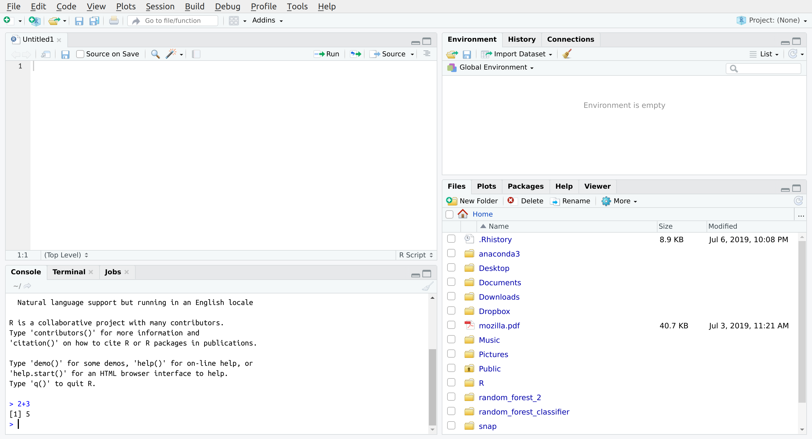
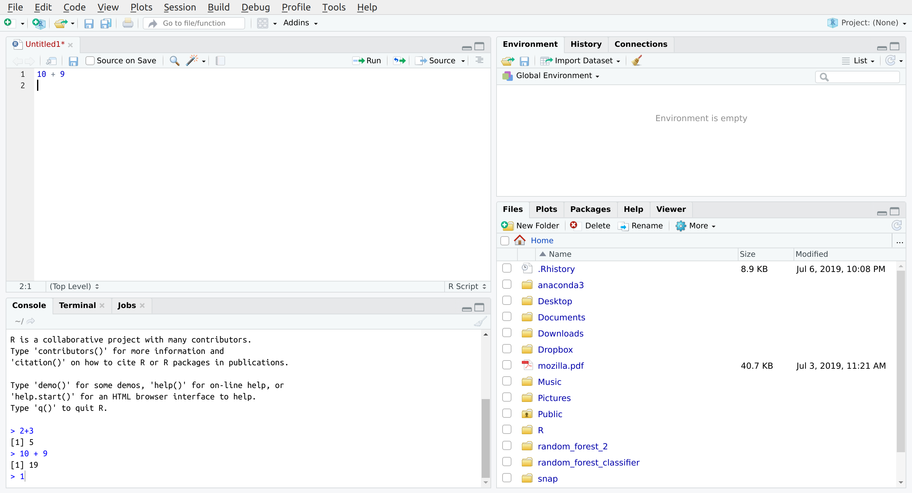
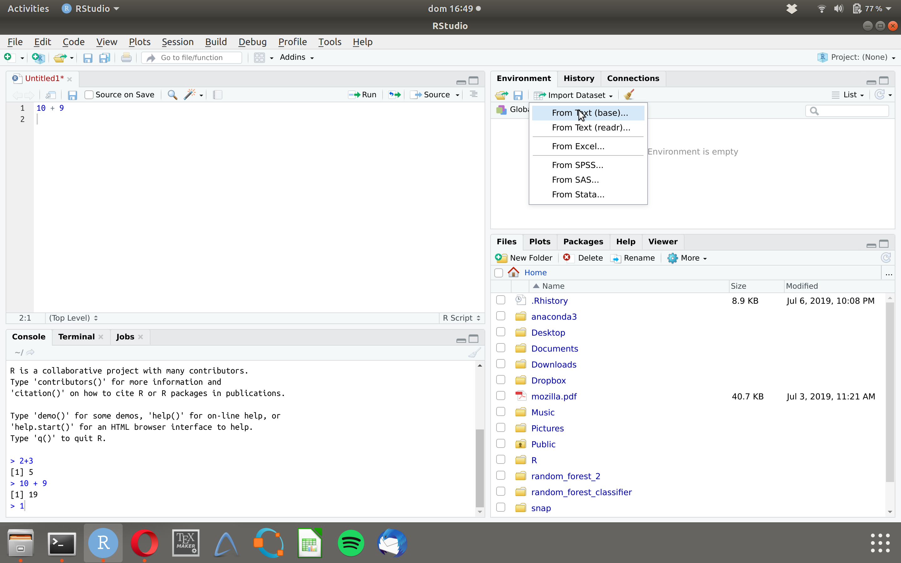

# R {#R}

```{r, echo = FALSE, message=FALSE}
library(ggplot2)
library(ggimage) 
library(grid)
library(emoGG) #devtools::install_github("dill/emoGG")
library(tidyverse)
library(beepr)
library(gridExtra)
library(latex2exp)
library(DescTools)
library(cowplot)
library(filesstrings)
filedir <- "datasets/"
subDir  <- "Mi_curso_de_R"
subcarpeta <- "~/Desktop/Mi_curso_de_R"

require(knitr)
require(kableExtra)
require(reshape2)
require(data.tree)

#Knitr table options
#options(knitr.table.format = "html") 

#Chunk options
#opts_chunk$set(echo = FALSE)
#opts_chunk$set(results = 'asis')
opts_chunk$set(fig.width  = 4)
opts_chunk$set(fig.height = 4)
opts_chunk$set(fig.align='center')

```


## Programación en `R`

```{r, fig.cap = "`R` es un programa chido de estadística. FIN.", fig.width=1.5, fig.height=1.5, cache=TRUE, echo = FALSE, message=FALSE}
knitr::include_graphics('images/rlogo.png')
```


Una de las primeras cosas que necesitamos saber es que `R` (por más que sus más ávidos defensores digan lo contrario) no es para todo. Si tú ya conoces otro lenguaje (sea `Stata`, `Excel`, `SAS`, `Python`, `Matlab`, `Julia`, etc) sabrás utilizar muchas de sus opciones. Estoy seguro que, de conocer uno de estos, te será muchísimo más fácil seguir sacando promedios en tu lenguaje favorito que en `R`, realizar regresiones lineales es probablemente más sencillo en `Stata` mientras que las gráficas de barras para mí son más simples en `Excel`, `Python` excede en aplicaciones de inteligencia artificial mientras que `Matlab` es más veloz que `R`, `Julia` tiene muchas cosas de ecuaciones diferenciales que nadie más. 

Lo que probablemente no sea más sencillo de hacer en otro lenguaje es realizar análisis estadístico, gráficas de todo tipo y modelos de simulación. Para eso, `R` es, indiscutiblemente, una de las mejores opciones para quienes no conocen de programación^[Modelos de simulación más avanzados suelen hacerse en `C`, `C++` o `Fortran` por su velocidad; empero, es necesario conocer más de programación.]. 

Finalmente, uno de los consejos más importantes que te puedo dar es que este curso no te va a servir si no practicas. Igual que como pasa con los idiomas uno no aprende `R` en una semana _sin practicarlo después_. Mi sugerencia es que, a la vez que sigues estas notas comiences a trabajar un proyecto _tuyo_ específico junto con [el buscador de Internet de tu preferencia](https://yandex.com) a la mano y empieces a usar `R` en él. Practica^[La práctica hace al maestro]. 

### Puntos a favor de `R`

- Todo el mundo lo usa. Quizá éste es el punto más a favor. Si mucha gente lo conoce y lo utiliza, hay más opciones de ayuda. Los sitios de StackOverflow [en inglés](https://stackoverflow.com) y [en español](https://es.stackoverflow.com) son excelentes para pedir apoyo en `R`; los [grupos de usuarios de Google](https://groups.google.com/forum/#!forum/r-help-archive) son otra fuente muy buena. Entre más gente usa el programa; es más fácil obtener ayuda porque seguro alguien más tuvo hace ya tiempo el mismo problema que tú. 
- Todas las personas que trabajan en estadística publican sus métodos y su código en `R` (eso, claro, cuando publican sus métodos). Es raro encontrar _un nuevo método estadístico_ en el mundo y que no se pueda usar, de alguna forma, en `R`. 

- Dentro de los lenguajes de programación `R` es de los más sencillos. Quienes lo hicieron realmente se preocuparon por su público (de no especialistas) y en general desarrollan para él. 

- `R` es gratis. Y en esta época de austeridad, cualquier ahorro es bueno. Que sea gratis no significa que no esté respaldado: existen versiones de `R` respaldadas por grandes compañías como [Microsoft](https://mran.microsoft.com/open)

- Todo lo que se hace en `R` es público. `R` no tiene métodos secretos ni es una caja negra. Todo lo que hace cada una de las funciones de `R`, cualquiera lo puede revisar, por completo. 

- En `R` puedes hacer libros o notas ¡como este! donde guardes todo tu trabajo, reportes automatizados e incluso [documentos interactivos](https://gallery.shinyapps.io/086-bus-dashboard/) para facilitar el análisis de datos. 

- `R` puede hacer gráficas bonitas: 

```{r, echo = FALSE, message = FALSE, warning = FALSE}
rojos  <- data.frame(x = rnorm(100, 1), y = rnorm(100,1))
verdes <- data.frame(x = rnorm(100, -1), y = rnorm(100,-2))
xmin   <- c(-4,4)
ymin   <- c(-4,4)
scatter <- ggplot(mapping=aes(x = x, y = y)) + 
  geom_point(data = verdes, color = "deepskyblue3", size = 4) + 
  geom_point(data = rojos, color = "tomato3", size = 4) +
  geom_point(data = data.frame(x = 1, y = 2), color = "black", size = 5) +
  geom_point(data = data.frame(x = 1, y = 2), color = "orange", size = 3) +
  theme_classic() +
  theme(plot.background = element_rect(fill = "white"),
        panel.background = element_rect(fill = "white")) +
  xlim(xmin[1],xmin[2]) + ylim(ymin[1],ymin[2]) + 
  xlab("Una variable") + 
  ylab("Otra variable") +
  ggtitle("Datos simulados de X y Y")

empty <- ggplot()+geom_point(aes(1,1), colour="white")+
         theme(axis.ticks=element_blank(), 
               axis.text.x=element_blank(), axis.text.y=element_blank(),                plot.background = element_rect(fill = "white"),
               panel.background = element_rect(fill = "white"),
               axis.title.x=element_blank(), axis.title.y=element_blank())

xhist <- seq(xmin[1],xmin[2], length.out = 100)
hist_top <- ggplot(mapping=aes(x=x,y=y)) + 
  geom_line(color="tomato3", data = data.frame(x = xhist, y = dnorm(xhist,1))) +
  geom_line(color="deepskyblue3", data = data.frame(x = xhist, y = dnorm(xhist,-1))) +
  theme_classic() + xlim(xmin[1],xmin[2]) + 
  theme(plot.background = element_rect(fill = "white"),
        panel.background = element_rect(fill = "white")) +
  ylab("Densidad") + xlab("") +
  ggtitle("Proyección 2")

yhist      <- seq(ymin[1],ymin[2], length.out = 100)
hist_right <- ggplot(mapping=aes(x=x,y=y)) + 
                geom_line(color="tomato3", data = data.frame(x = yhist, y = dnorm(yhist,1))) +
                geom_line(color="deepskyblue3", data = data.frame(x = yhist, y = dnorm(yhist,-2))) + 
                  ylab("Densidad") + xlab("") +
                ggtitle("Proyección 1") +
                theme_classic() + theme(plot.background = element_rect(fill = "white"),
                      panel.background = element_rect(fill = "white")) +
                xlim(ymin[1],ymin[2]) + coord_flip()

g <- arrangeGrob(
            hist_top +  geom_vline(xintercept = 0, linetype="dashed", color = "forestgreen"), 
            empty, 
            scatter +  geom_vline(xintercept = 0, linetype="dashed", color = "forestgreen") +
              geom_hline(yintercept = -0.5, linetype="dashed", color = "forestgreen") + 
              annotate("text", x = -3.5, y = 3.5, label = TeX("$\\Omega_1$"), color = "black") + 
              annotate("text", x = 3.5,  y = 3.5, label = TeX("$\\Omega_2$"), color = "tomato3") + 
              annotate("text", x = 3.5, y = -3.5, label = TeX("$\\Omega_3$"), color = "black") + 
              annotate("text", x = -3.5, y = -3.5, label = TeX("$\\Omega_4$"), color = "deepskyblue3"), 
            hist_right +  geom_vline(xintercept = -0.5, linetype="dashed", color = "forestgreen"), ncol=2, nrow=2, widths=c(5, 2), heights=c(2, 5),
            bottom = textGrob("RESULTADOS DE LA SIMULACIÓN", gp=gpar(fontface="bold", col ="black")))

cowplot::ggdraw(g) + 
  theme(plot.background = element_rect(fill="white", color = NA))

```


Por supuesto, no todo es miel sobre hojuelas con `R`. Particularmente, algunos de los problemas con el lenguaje:

```{r,  fig.cap = "La curva de aprendizaje de `R` es más empinada pero después de un rato vale la pena", fig.width=5.5, fig.height=3.5, cache=TRUE, echo = FALSE, message=FALSE}

#Get data
x     <- seq(-0.5,2, length.out=250)
pdata <- data.frame(x = x, y = x^2)

ggplot(pdata) + 
  geom_vline(xintercept = 1, linetype = "dashed", color = "gray", size = 0.5) +
  geom_hline(yintercept = 1, linetype = "dashed", color = "gray", size = 0.5) +
  geom_vline(xintercept = 0, linetype = "dashed", color = "gray", size = 0.5) +
  geom_hline(yintercept = 0, linetype = "dashed", color = "gray", size = 0.5) +
  geom_line(aes(x = x, y = y, color = "STATA, SPSS ó SAS"), data = subset(pdata, x > 0)) +
  geom_line(aes(x = x, y = 0, color = "STATA, SPSS ó SAS"), data = subset(pdata, x < 0)) + 
  geom_line(aes(x = x, y = x, color = "R")) + 
  geom_point(aes(x = x, y = y), color = "gray", data = data.frame(x = 1, y = 1)) + 
  geom_point(aes(x = x, y = y), color = "gray", data = data.frame(x = 0, y = 0)) + 
  theme_classic() + 
  ylab(toupper("Dificultad para programar")) +
  xlab(toupper("Dificultad del modelo")) + 
  coord_cartesian(ylim = c(-0.5, 4), clip = 'off') + 
  annotate("text", x = 0.5, y = -0.9, label = "No uses R") +
  annotate("text", x = 1.5, y = -0.9, label = "Usa R") +
  annotate("text", x = -0.25, y = -0.9, label = "¡R!") +
  theme(axis.text = element_blank(),
        axis.title.x = element_text(margin = margin(0.5, unit = "cm")),
        axis.ticks.y = element_blank(),
        axis.ticks.length.x = unit(.5, "cm")) + 
  scale_x_continuous(breaks = c(0,1)) +
  scale_y_continuous(breaks = c(0,1)) + 
  scale_color_manual("Programa", 
                     values = c("STATA, SPSS ó SAS" = "tomato3", 
                                "R" = "deepskyblue3"))

```

- La curva de aprendizaje es mucho más empinada que para otros programas estadísticos (como  `Stata`, `SAS` o `SPSS`) ¡particularmente si es tu primera vez programando!

- La mayor parte de las personas que trabajan en `R` no son programadores de verdad. Gran parte del código que te puedes encontrar **en el mundo real** está escrito [con prisa para salir del aprieto](https://nsaunders.wordpress.com/2014/05/14/this-is-why-code-written-by-scientists-gets-ugly/) sin mucha planeación, con pocos comentarios, falta de control de versiones y pocas herramientas de revisión. ¡Internet está lleno de [creaturas espantosas escritas en `R`](https://codegolf.stackexchange.com/a/4011)!

```{r,fig.cap = "`R` puede ser muy lento pero eso te da oportunidad de hacer otras cosas ;) .", fig.width=4.5, fig.height=4.5, cache=TRUE, echo = FALSE,  message=FALSE}
knitr::include_graphics('images/compiling.png')
```

- `R` [de ninguna manera es veloz](https://github.com/matthieugomez/benchmark-stata-r) por lo que algunos programas (lo veremos en simulación) pueden ser extremada (y dolorosamente) lentos.  

### Bienvenidx a `R`, `r R.Version()$nickname` (sí, así se llama esta versión)

`R` es un lenguaje de cómputo y un programa estadístico [libre](https://www.gnu.org/philosophy/free-sw.html), gratuito, [de programación funcional](http://adv-r.had.co.nz/Functional-programming.html) (¿qué es eso?), [orientado a objetos](https://en.wikipedia.org/wiki/Object-oriented_programming) (_what??_) que mutó a partir de otros dos lenguajes conocidos como `Scheme` y `S`^[De ahí que se llame `R` porque la `R` es una mejor letra que la `S` (todos lo sabemos) 
-Atte. Rodrigo, el autor de este documento.]. El primero de estos fue  desarrollado en el MIT por Sussman y Steele mientras que el segundo surgió en los laboratorios Bell^[Mejor conocidos ahora como AT&T, la compañía celular que nunca tiene señal.] creado por Becker, Wilks y Chambers. `R` [nació en junio de 1995](https://cran.r-project.org/doc/html/interface98-paper/paper_2.html) a partir del trabajo de 	Ross Ihaka y Robert Gentleman^[Sus nombres empiezan con la letra `R` ¿coincidencia?]. 

Desde su creación, la mayor parte del desarrollo de `R` ha sido trabajo completamente voluntario de la [Fundación R](https://www.r-project.org/foundation/), del equipo de R Core y de miles de usuarios que han creado funciones específicas para `R` conocidas como paquetes (`packages`). Actualmente el repositorio más importante de `R`, CRAN, contiene más de _16000_ paquetes con distintas funciones para hacer ¡lo que quieras!

Como todo el trabajo en `R` es voluntario hace falta: 

1. Una homologación en los métodos. Puedes encontrar varias funciones _que supuestamente hacen exactamente lo mismo_ (como es el caso de `emojifont`, `fontemoji` y `emoGG` para graficar usando emojis). 

2. Estandarizar la notación. Algunos paquetes como aquellos del `tidyverse` (veremos más adeltna) utilizan `pipes` (`%>%`); estos sólo funcionan en el `tidyverse` pero no fuera del mismo.

Sin embargo, también es una gran ventaja que sean los usuarios de `R` quienes guían su desarrollo. El lenguaje va mutando según peticiones de las personas que lo usan. Si hay algo que te gustaría `R` tuviera y aún no existe ¡lo puedes proponer! 

## Instalando cosas

### Instalación de `R`

```{r, fig.cap = "Oficialmente, la página de `R` es de las páginas más feas del mundo. ¡No te dejes llevar por las apariencias!", fig.width=3.5, fig.height=3.5, cache=TRUE, echo = FALSE,  message=FALSE}
knitr::include_graphics('images/CRAN1.png')
```

A lo largo de estas notas estaré trabajando con: `r R.Version()$version.string` _`r R.Version()$nickname`_. La más reciente versión de `R` la puedes encontrar en [CRAN](https://cran.r-project.org). Para ello ve al sitio y selecciona tu plataforma. 

> **Nota usuarios de Mac** En algunas Mac, al abir R, aparece el siguiente mensaje de advertencia:
`During startup - Warning messages: 1: Setting LC_CTYPE failed [...]`
para [solucionarlo](https://stackoverflow.com/questions/9689104/installing-r-on-mac-warning-messages-setting-lc-ctype-failed-using-c) ve a `Aplicaciones` y abre `Terminal`. Copia y pega en ella el siguiente texto:
`defaults write org.R-project.R force.LANG en_US.UTF-8`
Da enter, cierra la `Terminal` y reinicia `R`. 

- En el caso de Windows da clic en `Download R for Windows` y luego en `install R for the first time`. Finalmente, ejecuta el instalable que aparece al dar click en  ``r paste0("Download R ", R.Version()$major,".",R.Version()$minor," for Windows")`` . 

> Para este curso pudiera ser que requirieras las herramientas de desarrollador [Rtools](https://cran.r-project.org/bin/windows/Rtools/).

- En el caso de Mac selecciona `Download R for (Mac) OS X` y luego elige   ``r paste0("R-", R.Version()$major,".",R.Version()$minor,".pkg")``. En Mac puede que necesites instalar adicionalmente [XQuartz](https://www.xquartz.org) (según tu versión de Mac). Si tu Mac es una versión suficientemente antigua, sigue las instrucciones específicas de `CRAN`.  

- En el caso de Linux al elegir `Download R for Linux` tendrás la opción de buscar tu distribución específica. Al elegirla, aparecerán instrucciones para tu terminal de comandos; síguelas. En el caso de Linux, según los paquetes de `R` que elijamos instalar en la computadora requerirás instalar paquetería adicional para tu distribución de Linux. `R` te informará de la paquetería necesaria conforme la requiera.    

> Si tienes problemas para instalar puedes usar [RStudio Cloud](https://rstudio.cloud).

## Instalación de `RStudio`

```{r,  fig.cap = "RStudio es una empresa que se dedica a hacer cosas para R.", fig.width=3.5, fig.height=3.5, cache=TRUE, echo = FALSE,  message=FALSE}
knitr::include_graphics('images/rstudio.png')
```

`RStudio` es una interfaz gráfica (IDE) para `R`. Puedes pensar a `R` como el _Bloc de Notas_ y a `RStudio` como _Word_. El _Bloc_ tiene todas las capacidades que necesitas para poder escribir; empero, es muchísimo mejor trabajar tus _papers_ en _Word_. De la misma manera, `R` tiene todas las capacidades para hacer estadística _pero un formato horrible_ y `RStudio` se ha convertido en la más popular forma de usar `R`. Por supuesto que no es la única; algunas alternativas son [Atom con ide-r](https://atom.io/packages/ide-r), [Eclipse con StatET](https://marketplace.eclipse.org/content/statet-r) y [RKWard](https://rkward.kde.org). En general es posible seguir estas notas sin que tengas `RStudio` pero, si es tu primera vez programando, no lo recomiendo.

> Si ya tienes experiencia con lenguajes como Python, Javascript, Java ó alguno de los mil C que existen, no tendrás ningún problema usando el editor de tu preferencia.

Para descargar `RStudio` ve a [su página](https://www.rstudio.com) y da clic en `Download RStudio`. Baja tu pantalla hasta donde dice `Installers for Supported Platforms` y elige tu plataforma: `Windows`, `Mac OS X` ó tu sabor de `Linux` preferido. Una vez descargado el archivo, ábrelo y sigue las instrucciones que aparecen en pantalla.  


## Primeros pasos en `R` usando `RStudio`
Una vez hayas instalado `R` y `RStudio`, abre `RStudio`^[Si decidiste no instalar RStudio salta al final de esta sección.]. Te enfrentarás a una pantalla similar a esta: 

```{r fig-main, fig.cap = "La primera vez que abres RStudio", cache=TRUE, echo = FALSE}
knitr::include_graphics('images/RStudio1.png')
```

Si tu RStudio tiene sólo 3 páneles, como en mi caso, ve a la esquina superior izquierda (signo de hoja+) y elige un nuevo `R Script`

```{r, fig.cap = "Elige hoja+ para crear un nuevo archivo", cache=TRUE, echo = FALSE}
knitr::include_graphics('images/RStudio2.png')
```

Tendrás, entonces, 4 páneles como se ve a continuación: 

```{r, fig.cap = "RStudio <3", cache=TRUE, echo = FALSE}
# Import the image
library(grid)
bg <- png::readPNG("images/RStudio3.png")
ggplot() +  
  annotation_custom(rasterGrob(bg, 
                                 width = unit(1,"npc"), 
                                 height = unit(1,"npc")), 
                      -Inf, Inf, -Inf, Inf) +
  geom_label(aes(x = 2.5, y = 1.5), fill = "deepskyblue3", color = "white", alpha = 0.95,
              label = "1", size = 10) +
  geom_label(aes(x = 2.5, y = 7.5), fill = "deepskyblue3", color = "white", alpha = 0.95,
              label = "2", size = 10) +
  geom_label(aes(x = 7.5, y = 1.5), fill = "deepskyblue3", color = "white", alpha = 0.95,
              label = "4", size = 10) +
  geom_label(aes(x = 7.5, y = 7.5), fill = "deepskyblue3", color = "white", alpha = 0.95,
              label = "3", size = 10) +
  xlim(c(0,10)) + ylim(c(0,10)) + theme_void()


```


1. El primer panel (esquina inferior izquierda) es la `Consola`. Aquí es donde se ejecutan las acciones. Prueba escribir `2 + 3` en él y presiona enter. Aparece el resultado de la suma. Definitivamente, `R` es la calculadora que más trabajo cuesta instalar. 

```{r,  fig.cap = "La consola de `R` es la calculadora más difícil de instalar que existe.", cache=TRUE, echo = FALSE,  message=FALSE}

```

2. El segundo panel (esquina superior izquierda) es el panel con el `Script`. Aquí se escribe el programa pero no _se ejecuta_. Prueba escribir `10 + 9`. ¿Ves que no pasa nada? Lo que acabas de hacer es crear un programa que, cuando se ejecute, hará la suma de `10 + 9`. ¡Qué programa más aburrido! Sin embargo, no todo está perdido: presiona `CTRL+Enter` (`Cmd+Enter` en Mac) al final de la línea o bien da clic en `Run` y verás que, en la consola, aparece la instrucción y el resultado de la misma. El `Script` es una excelente fuente para tener un historial de lo que estás haciendo. 

```{r, fig.cap = "El `Script` sirve para salvar las instrucciones en el orden en que las vas a ejecutar.", cache=TRUE, echo = FALSE,  message=FALSE}

```

3. El tercer panel contiene el ambiente. Aquí aparecerán las variables que vayamos creando. Por ahora, para poner un ejemplo, importaremos el archivo `Example1.csv` (con valores simulados) [disponible en Github](https://github.com/RodrigoZepeda/LibroEstadistica/tree/master/datasets) dando clic en `Import Dataset` y `From Text (base)`. Selecciona el archivo y elige las opciones en la ventana de previsualización que hagan que se vea bien. Nota que una vez realizada la importación aparece en el panel derecho `Example1.` Al dar clic podrás ver la base de datos. Las bases de datos y variables que utilices durante tus análisis aparecerán en esa sección.

```{r, echo = FALSE}
set.seed(371)
Example1 <- data.frame(Alturas = rnorm(100, 1.65, 0.3), Peso = rnorm(100, 80, 1))
write.csv(Example1, paste0(filedir,"Example1.csv"), row.names=FALSE)
```

```{r, fig.cap = "El `Ambiente` muestra las variables (incluyendo bases de datos) que estás utilizando en este momento. A diferencia de otros programas estadísticos (o sea `Stata`) en `R` es posible tener múltiples bases de datos abiertas a la vez.",  cache=TRUE, echo = FALSE,  message=FALSE}

```

4. Para entender mejor lo que ocurre en el último de los páneles, lo mejor es trabajar con nuestra base. Escribe en la consola `plot(Example1)` . En el cuarto pánel aparecerá una gráfica. El cuarto de los páneles para nosotros tendrá esa utilidad: mostrará las gráficas que hagamos así como la ayuda. Para ver la ayuda para las instrucciones de `R` puedes escribir `?`. Prueba teclear `?plot` en la consola. El signo de interrogación es un `help()` que muestra las instrucciones para usar una función.  

```{r,  fig.cap = "La gráfica que aparece de hacer un `plot` de la base de datos de ejemplo.",  cache=TRUE, echo = FALSE, message=FALSE}
plot(Example1)
```

```{r,  fig.cap = "El cuarto panel muestra respectivamente las gráficas y la ayuda.", cache=TRUE, echo = FALSE,  message=FALSE}
knitr::include_graphics('images/RStudio7.png')
```

Mi sugerencia personal es que escribas todo lo que haces en el `Script` y que sólo utilices la consola para verificar valores. De esta manera podrás almacenar todas las instrucciones ejecutadas y volver a ellas cuando se requieran. Por último te sugiero utilizar `#` gatos para comentar tu código. Así, el código anterior lo podrías ver en la consola como:

```{r, eval = FALSE}
#Aquí pruebo cómo R hace las sumas
10 + 9
```

[Comenta](https://www.freecodecamp.org/news/code-comments-the-good-the-bad-and-the-ugly-be9cc65fbf83/). [Comenta](https://www.c-sharpcorner.com/blogs/why-comments-are-important-while-writing-a-code). [Comenta, por favor](https://blog.codinghorror.com/code-tells-you-how-comments-tell-you-why/). Tu ser del futuro que regrese a sus archivos de `R` un mes después de haberlos hecho te lo agradecerá (y tu profe también). 

Finalmente y como aclaración para estas notas, el código de `R` aparece como:
```{r, eval = FALSE}
#Esto es código de R
7 - 2
```

Mientras que los resultados de evaluar en `R` se ven con `#`:
```{r, echo = FALSE}
#Esto es código de R
7 - 2
```

Así, la evaluación con su resultado se ve de la siguiente forma:
```{r}
#Esto es código de R
7 - 2
```

## Cálculos numéricos
`R` sirve como calculadora para las operaciones usuales. En él puedes hacer sumas,

```{r}
#Esto es una suma en R
12 + 31
```

```{r,  fig.cap = "Ada Lovelace (1815-1852), la primera en diseñar un algoritmo computacional ¡y sin tener computadoras!", fig.width=3.5, fig.height=3.5, cache=TRUE, echo = FALSE, message=FALSE}
knitr::include_graphics('images/ada_lovelace.jpg')
```

restas,
```{r}
#Esto es una resta en R
3 - 4
```
 
multiplicaciones,
```{r}
#Esto es una multiplicación en R
7*8
```

divisiones,
```{r}
#Esto es una división en R
4/2
```


sacar logaritmos naturales $\ln$,
```{r}
#Para sacar logaritmo usas el comando log
log(100)
```

o bien logaritmos en cualquier base,^[Recuerda que un logaritmo base $a$ te dice a qué potencia $b$ tuve que elevar $a$ para llegar a $b$. Por ejemplo $\log_{10}(100) = 2$ te dice que para llegar al $100$ tuviste que hacer $10^2$.]
```{r}
#Puedes especificar la base del logaritmo con base 
log(100, base = 10)
```

también puedes elevar a una potencia (por ejemplo hacer $6^3$),
```{r}
#Así se calculan potencias
6^3
```

calcular la exponencial $e$,
```{r}
#Para exponenciales puedes usar exp
exp(1)
```

o bien exponenciar cualquier variable $e^{-3}$,
```{r}
#O bien exponenciales específicas, e^-3
exp(-3)
```

también puedes usar el número $\pi$.
```{r}
#Cálculo de pi
pi
```

No olvides que `R` usa el orden de las operaciones de matemáticas. Siempre es de izquierda a derecha con las siguientes excepciones: 

1. Primero se evalúa lo que está entre paréntesis. 

2. En segundo lugar se calculan potencias. 

3. Lo tercero en evaluarse son multiplicaciones y divisiones. 

4. Finalmente, se realizan sumas y restas. 

Por ejemplo, en la siguiente ecuación 
$$
2 - 2 \cdot \frac{(3^4 - 9)}{(5 + 4)}
$$
se resuelven primero los paréntesis $(3^4 - 9) = 81 - 9 = 72$ y $(5 + 4) = 9$; luego se resuelve la división: $\frac{72}{9}=8$, se multiplica por el $2$: $2 \cdot 8 = 16$ y finalmente se hace la resta: $2-16 = -14$. 

### Ejercicio 
Determina, sin evaluar, los resultados de los siguientes segmentos de código:
```{r, eval = FALSE}
#Primer ejercicio 
(9 - 3)^2 * (2 - 1) - 6
```


```{r, eval = FALSE}
#Segundo ejercicio 
6 * 2 / (7 - 3) * 5
```

```{r, eval = FALSE}
#Tercer ejercicio 
2 * 3 ^ 2 * 2 / (5 - 4) * 1 / 10 
```

Evalúa para comprobar tu respuesta. 

### Ejercicio 
Calcula el área y el perímetro de un círculo de radio 5. Recuerda que la fórmula del área es $\pi \cdot r^2$ donde $r$ es el radio; mientras que la del perímetro es: $\pi \cdot d$ donde $d$ es el díametro (= dos veces el radio).

### Respuestas
```{r, echo = FALSE}
r = 5
cat(paste0("Área = ", pi*r^2,"\n"))
cat(paste0("Perímetro = ", pi*r*2))
```

## Variables

`R` es un programa orientado a objetos; esto quiere decir que `R` almacena la información en un conjunto de variables que pueden tener diferentes `clases` y opera con ellos según su clase. Por ejemplo, un conjunto de caracteres, entre comillas, es un `Character` (`R` lo piensa como texto)

```{r}
#Un conjunto de caracteres es un char
"Hola"
```

Un número (por ejemplo `2` tiene clase `numeric`)^[Puede ser `float`, `int`, `double` pero no nos preocuparemos por eso.]. Hay que tener mucho cuidado con combinar floats con `Strings`:

```{r}
#Código que sí funciona porque ambos son números
2 + 4 
```

```{r, fig.cap = "El algoritmo diseñado por Ada Lovelace.", fig.width=3.5, fig.height=3.5, cache=TRUE, echo = FALSE,, message=FALSE}
knitr::include_graphics('images/algorithm_lovelace.jpg')
```

```{r, error = TRUE}
#Código que no funciona porque uno es caracter
2 + "4" 
```

Si lo piensas, este último error ¡tiene todo el sentido! no puedes sumar un número a un texto. ¿O qué significaría `'Felices' * 4` ?

La magia de `R` comienza con que puedes almacenar valores en variables. Por ejemplo, podemos asignar un valor a una variable:
```{r}
#Asignamos x = 10
x <- 10
```


Hay dos formas de asignar valores, una es con la flecha de asignación $\leftarrow$ y otra con el signo de igual:
```{r}
#Podemos asignar valores con el signo de =
y = 6
```

Nota que, cuando realizamos operaciones, la asignación es la última  que se realiza:
```{r}
#Aquí z = 106
z <- y + x^2
```

Los valores que fueron asignados en las variables, `R` los recuerda y es posible calcular con ellos:
```{r}
#Podemos realizar una suma
x + y

#O bien podemos realizar una multiplicación
3*y - x
```

Podemos preguntarnos por el valor de las variables numéricas mediante los operadores `==` (sí, son dos iguales), `!=` (que es un $\neq$) `>`, `>=`, `<=` y `<`:
```{r}
#Podemos preguntarnos si x vale 4
x == 4
```

> El operador de asignación también se puede utilizar al revés $2 \rightarrow x$ pero no lo hagas, por favor. 

Nota que no estamos asignando el valor de `x`:
```{r}
x
```

Podemos preguntarnos por diferencia:
```{r}
x != 4 
```

Así como por mayores, menores incluyendo posibles igualdades (_i.e._ los casos $\geq$ y $\leq$)
```{r}
#Nos preguntamos si x > y
x > y

#Nos preguntamos si x >= 10
x >= 10

#Nos preguntamos si y < 6
y < 6

#O bien si y <= 6
y <= 6
```

En todos los casos los resultados han sido `TRUE` ó `FALSE`. La clase de variables que toma valores `TRUE` ó `FALSE` se conoce como booleana. Hay que tener mucho cuidado con ellas porque, puedes acabar con resultados muy extraños:

```{r}
#MALAS PRÁCTICAS, NO HAGAS ESTO
#Cuando lo usas como número TRUE vale 1
100 + TRUE

#MALAS PRÁCTICAS, NO HAGAS ESTO
#Cuando lo usas como número FALSE vale 0
6*FALSE
```

> [Aquí](https://medium.com/mindorks/common-bad-programming-practices-7fb470ed74d2) puedes encontrar una lista de malas prácticas en computación a evitar. 

Finalmente, nota que es posible reescribir una variable y cambiar su valor:
```{r}
#Aquí x vale 10, como antes
x

#Aquí cambianos el valor de x y valdrá 0.5
x <- 0.5
x
```

### Ejercicios
Determina el valor que imprime `R` en cada caso, sin que corras los siguientes pedazos de código. Después, verifica tu respuesta con `R`:

```{r, eval = FALSE}
#Primer ejercicio
x <- 100
y <- 3
x > y
```

```{r, eval = FALSE}
#Segundo ejercicio
z <- (4 - 2)^3
z <- z + z + z
z
```

```{r, eval = FALSE}
#Tercer ejercicio
x <- 3
y <- 2
z <- x * y
x <- 5
y <- 10
z
```

```{r, eval = FALSE}
#Cuarto ejercicio
variable1 <- 1000
variable2 <- 100
variable3 <- variable1/variable2 <= 10
variable3
```

```{r, eval = FALSE}
#Quinto ejercicio
"2" - 2
```

```{r, eval = FALSE}
#Sexto ejercicio
(0.1 + 0.1 + 0.1) == 0.3
```

### NIVEL 3

Determina, sin correr el programa, qué regresa la consola en este caso
```{r, eval = FALSE}
x <- 2 
x <- 5 + x -> y -> x
x <- x^2
x
```

Comprueba con la consola tus resultados; puede que encuentres respuestas poco intuitivas. 

## Observaciones sobre la aritmética de punto flotante

Si hiciste el penúltimo ejercicio (el cual, obviamente hiciste y comprobaste con la consola) podrás haber notado una trampa. Analicemos qué ocurre; quizá hicimos mal la suma
```{r}
#Veamos si este lado está mal
(0.1 + 0.1 + 0.1)

#O si éste es el que tiene la trampa
0.3
```

Aparentemente no hay nada malo ¿qué rayos le pasa a `R`? La respuesta está [en la aritmética de punto flotante](https://www.youtube.com/watch?v=PZRI1IfStY0). Podemos pedirle a `R` que nos muestre los primeros 100 dígitos de la suma `0.1 + 0.1 + 0.1`:

```{r, fig.cap = "Réplica de la Z3, la primer computadora con punto flotante (1941).", fig.width=3.5, fig.height=3.5, cache=TRUE, echo = FALSE,  message=FALSE}
knitr::include_graphics('images/Z3_Deutsches_Museum.jpeg')
```

```{r}
#Veamos qué pasa con la suma
options(digits = 22) #Cambiamos dígitos
(0.1 + 0.1 + 0.1)    #Sumamos
```

> El comando `options(digits = 22)` especifica que `R` debe imprimir en la consola `22` dígitos. No más. 

¡[Ahí está el detalle](https://www.youtube.com/watch?v=1jaCpeXg-gg)! `R` no sabe sumar. En general, ningún programa de computadora sabe hacerlo. Veamos otros ejemplos:

```{r}
4.1 - 0.1 #Debería dar 4
3/10      #Debería ser 0.3
log(10^(12345), base = 10) #Debería dar 12345
``` 

El problema está en cómo las computadoras representan los números. Ellas escriben los números en binario. Por ejemplo, 230 lo representan como `r DescTools::DecToBin(230)` mientras que el 7 es: `r DescTools::DecToBin(7)`. El problema de las computadoras radica en que éstas tienen una memoria finita por lo que números muy grandes como: $124765731467098372654176$ la computadora hace lo mejor por representarlos eligiendo el más cercano:
```{r}
#Nota la diferencia entre lo que le decimos a R
#y lo que resulta
x <- 124765731467098372654176
x
```

> Un error de punto flotante en la vida real ocasionó en los años noventa, [la explosión del cohete `Ariane 5`](https://www.esa.int/Newsroom/Press_Releases/Ariane_501_-_Presentation_of_Inquiry_Board_report). Moraleja: hay que tener cuidado y respeto al punto flotante.  

No olvides cambiar la cantidad de dígitos que deseas que imprima `R` en su consola de vuelta:
```{r}
options(digits = 6) #Cambiamos dígitos
```

El mismo problema ocurre con números decimales cuya representación binaria es periódica; por ejemplo el $\frac{1}{10}$ en binario se representa como $0.0001100110011\overline{0011}\dots$. Como es el cuento de nunca acabar con dicho número, `R` lo trunca y almacena sólo los primeros dígitos de ahí que, cada vez que escribes `0.1`, `R` en realidad almacene el <code>`r sprintf(0.1, fmt = '%#.22f')`</code> que es _casi lo mismo_ pero no es estrictamente igual. Hay que tener mucho cuidado con esta inexactitud de las computadoras (inexactitud estudiada por la rama de [Análisis Numérico](https://www.springer.com/gp/book/9781461484523)) pues puede generar varios resultados imprevistos.

### ¿Cómo checar un if?

En general lo que hacen las computadoras para comparar valores es que verifican que, en valor absoluto, el error sea pequeño. Recuerda que el valor absoluto de $x$, $|x|$, regresa siempre el positivo:
$$
|4| = 4 \qquad \textrm{y} \qquad |-8| = 8
$$

Para verificar que algo es más o menos $0.3$ suele usarse el valor absoluto^[En `R` el comando `abs` toma el valor absoluto.] de la siguiente manera:
```{r}
abs( (0.1 + 0.1 + 0.1) - 0.3 ) < 1.e-6
```

donde `1.e-6` es notación corta para `r sprintf("%f", 1.e-6)`  (también escrito como $1\times 10^{-6}$). La pregunta que nos estamos haciendo es que si el error entre sumar $0.1+0.1+0.1$ y $0.3$ es muy pequeño $< 0.000001$:
$$
| (0.1 + 0.1 + 0.1) - 0.3 | < 0.000001
$$


## Leer y almacenar variables en `R`

Para terminar esta sección, aprenderemos cómo guardar variables en `R`. Para eso, el concepto de directorio es uno de los más relevantes. En general, en computación, [el directorio](https://en.wikipedia.org/wiki/Working_directory) se refiere a la dirección en tu computadora donde estás trabajando. Por ejemplo, si estás en una carpeta en tu escritorio de nombre "Ejercicios_R" probablemente tu directorio sea '~/Desktop/Ejercicios_R/' (en Mac) o bien '~\\Desktop\\Ejercicios_R\\'  en Windows^[Windows usa backslash. Y hay [toda una historia detrás de ello](https://www.howtogeek.com/181774/why-windows-uses-backslashes-and-everything-else-uses-forward-slashes/)]. La forma de saber tu directorio (en general) es ir a la carpeta que te interesa y con clic derecho ver propiedades (o escribir `ls` en la terminal `Unix`).

`R` tiene un directorio `default` que quién sabe dónde está (depende de tu instalación, generalmente está donde tu `Usuario`). Usualmente lo mejor es elegir un directorio para cada uno de los proyectos que hagas. Para ello si estás en `RStudio` puedes utilizar `Shift+Ctrl+H` (`Shift+Cmd+H` en Mac) o bien ir a `Session > Set Working Directory > Choose Directory` y elegir el directorio donde deseas trabajar tu proyecto. Pensando que elegiste el escritorio (`Desktop` en mi computadora) notarás que en la consola aparece el comando  `setwd("~/Desktop")` (o bien con '\\' si eres Windows). Mi sugerencia es que copies ese comando en tu `Script` para que, la próxima vez que lo corras ya tengas preestablecido el directorio. 

```{r, eval = FALSE}
#Si eres Mac/Linux
setwd("~/Desktop") 

#Si eres Windows
setwd("C:\Users\Rodrigo\Desktop") #Rodrigo = Mi usuario
```


Podemos verificar el directorio elegido con `getwd()`:
```{r, eval = FALSE}
getwd()
```


> En general es buena práctica en `R` establecer, hasta arriba del `Script`, el comando de directorio. Esto con el propósito de que, cuando compartas un archivo, la persona a quien le fue compartido el archivo pueda rápidamente elegir su propio directorio en su computadora. 

Probemos guardar unas variables en un archivo dentro de nuestro directorio. Para ello utilizaremos el comando `save`. 

```{r}
#Crear las variables
x <- 200
y <- 100

#Los archivos de variables de R son rda
save(x,y, file = "MisVariables.rda")
```

Si vas a tu directorio, notarás que el archivo `MisVariables.rda` acaba de ser creado. De esta forma `R` puede almacenar objetos creados en `R` que sólo `R` puede leer (más adelante veremos cómo exportar bases de datos y gráficas). Observa que en tu ambiente (si estás en `RStudio` puedes verlas en el panel 3) deben aparecer las variables que hemos usado hasta ahora:

```{r, echo = FALSE}
rm(rojos, empty, pdata, scatter, xmin, ymin, hist_right, hist_top,
   verdes, bg, g, r, xhist, yhist)
names(.GlobalEnv)[-which(names(.GlobalEnv) %in% c(".Random.seed", "escritorio","subDir","subcarpeta", "filedir"))]
```

Podemos probar sumar nuestras variables y todo funciona súper:
```{r}
x + y #Funciona magníficamente
```

Limpiemos el ambiente. El comando equivalente al `clear all` en `R` es un poco más complicado de memorizar: 
```{r, eval = FALSE}
#EL clear all de R
rm(list = ls())
```

```{r, echo = FALSE}
rm(x,y)
```

Ahora, si vuelves a ver el ambiente, éste estará vacío: ¡hemos limpiado el historial! Nota que si intentamos operar con las variables, `R` ya no las recuerda:

```{r, error=TRUE}
x + y #Error
```

> Así como hay que lavarse las manos antes de comer, es buen hábito limpiar todas las variables del ambiente de `R` antes de usarlo. 

Podemos leer la base de datos usando `load`:
```{r}
#Leemos las variables
load("MisVariables.rda")

#Una vez leídas podemos empezar a jugar con ellas
x + y #Ya funciona
```

Por último, es necesario resaltar la importancia del directorio. Para ello crea una nueva carpeta en tu escritorio de nombre <code>`r subDir`</code>. Mueve el archivo `"MisVariables.rda"` dentro de la carpeta. Borra todo e intenta leer de nuevo el archivo:

```{r, echo = FALSE, message=FALSE}
#file.move(path.expand("MisVariables.rda"), path.expand(subcarpeta))
```

```{r, eval = FALSE}
#Borramos todo
rm(list = ls())

#Intentamos leer el archivo de nuevo
load("MisVariables.rda")
```


```{r, echo = FALSE, error = TRUE}
setwd("~")
load("MisVariables.rda")
```

Este error es porque `R` sigue pensando que nuestro directorio es el escritorio y está buscando el archivo ahí sin hallarlo. Para encontrarlo hay que cambiar el directorio a través de `RStudio` (ya sea `Ctrl+Shift+H` o `Session >Set Working Directory > Choose Directory`) o bien a través de comandos en `R`: 

```{r, eval = FALSE}
#Si eres Mac/Linux
setwd("~/Desktop/Mi_curso_de_R") 

#Si eres Windows
setwd("C:\Users\Rodrigo\Desktop\Mi_curso_de_R") #Rodrigo = Mi usuario
```


```{r}
#Aquí sí se puede leer
load("MisVariables.rda")
```

### Ejercicio
Responde a las siguientes preguntas: 

1. ¿Qué es el directorio y por qué es necesario establecerlo? 

2. Si `R` me da el error `'No such file or directory'` ¿qué hice mal?

3. En `RStudio`, ¿qué hace `Session > Restart R`? ¿cuál es la diferencia con `rm(list = ls())`?

4. ¿Qué hace el comando `cat("\014")`? (_Ojo_ puede que no haga nada). Si funciona, ¿cuál es la diferencia con `rm(list = ls())` y con `Restart R`?

## Instalación de paquetes
Un paquete de `R` es un conjunto de funciones adicionales elaboradas por los usuarios, las cuales permiten hacer cosas adicionales en `R`. Para instalarlos requieres de una conexión a Internet (o bien puedes instalarlos a partir de un archivo, por ejemplo, mediante una `USB`). El comando de instalación es `install.packages` seguido del nombre del paquete. Por ejemplo (y por ocio) descarguemos el paquete `beepr` para hacer reproducir sonidos en la computadora^[En los siguientes capítulos descargaremos paquetes más interesantes; pero no desprecies la utilidad de `beepr` yo lo he usado en múltiples ocasiones para que la computadora me avise que ya terminó de correr un código.]. Para ello:  

```{r, eval = FALSE}
install.packages("beepr")
```

```
[...]
* DONE (beepr)

The downloaded source packages are in
	‘/algun/lugar/downloaded_packages’
```

Esto significa que el paquete ha sido instalado. Nos interesa usar la función `beep` que emite un sonido (`??beep` para ver la ayuda). Si la llamamos así tal cual, nos da error:
```{r, error = TRUE}
beep(3)
```

`R` es incapaz de hallar la función porque aún no le hemos dicho dónde se encuentra. Para ello podemos llamar al paquete mediante la función `library` y decirle a `R` que incluya las funciones que se encuentran dentro de `beepr`:

```{r}
library(beepr)
beep(3) #Esto produce un sonido
```

El comando `library` le dice a `R` ¡hey, voy a usar unas funciones que creó alguien más y que están dentro del paquete `beepr`! De esta manera, al correr `beep(3)`, `R` ya sabe dónde hallar la función y por eso no arroja error. 

### Ejercicios

**NIVEL 1**

1. Instala los paquetes `tidyverse` en `R`.
2. De `tidyverse` haz lo necesario para que el siguiente bloque de código te arroje una gráfica:

```{r}
#Aquí tienes que hacer algo
#
# RELLENA AQUÍ
#

#Esto genera un histograma
set.seed(1364752)
mis.datos <- data.frame(x = rnorm(1000))
ggplot(mis.datos, aes(x = x)) + 
  geom_histogram(bins = 50, fill = "deepskyblue3") +
  ggtitle("Histograma generado por el código")

```

**NIVEL 3**

1. Instala el paquete `devtools` (para hacerlo probablemente necesites instalar más cosas en tu computadora; averigua cuáles)
2. Usa `devtools` para instalar el paquete [`emoGG`](https://github.com/dill/emoGG) desde Github.
3. Verifica que tu instalación fue correcta haciendo la siguiente gráfica:
```{r}
library(emoGG)
ggplot(mtcars, aes(wt, mpg))+ geom_emoji(emoji="1f697")
```


## Comentarios adicionales sobre el formato
Así como en el español existen reglas de gramática para ponernos todos de acuerdo y entendernos entre todos, en `R` también existen _sugerencias_ a seguir para escribir tu código. Las sugerencias que aquí aparecen fueron adaptadas de las que [utiliza el equipo de `Google`](https://google.github.io/styleguide/Rguide.xml).

1. No escribas líneas de más de 80 caracteres (si se salió de tu pantalla, mejor continúa en el siguiente renglón).

2. Coloca espacios entre operadores `+,*,/,-,<-,=, <, <=, >, >=, ==` y usa paréntesis para agrupar: 
```{r, eval = FALSE}
#Esto no se ve muy bien
abs(3*5/(4-9)^2-60/100-888+0.1*8888-4/10*2) < 1.e-6

#Los espacios permiten distinguir el orden de las operaciones
abs( (3 * 5) / (4 - 9)^2 - 60 / 100 - 888 
      + (0.1 * 8888) - (4 / 10) * 2 ) < 1.e-6
```

3. Intenta alinear la asignación de variables para legibilidad:
```{r, eval = FALSE}
#Esto no tanto
altura <- 1.80
peso <- 80
edad <- 32

#Esto se ve bien
altura <- 1.80
peso   <- 80
edad   <- 32
```

4. Utiliza nombres que evoquen la variable que representas
```{r, eval=FALSE}
#Cuando regreses a esto no sabrás ni qué
x <- 10
y <- 2
z <- 3.14
W <- z * x^y #¿Qué calculé?

#Es mejor especificar la variable
radio        <- 10
potencia     <- 2
pi_aprox     <- 3.14
area_circulo <- pi_aprox * radio^potencia

```

5. No utilices un nombre demasiado similar para cosas diferentes. 
```{r}
#Aquí, seguro eventualmente te vas a equivocar
altura <- 10   #Altura del edificio
Altura <- 1.8  #Mi altura
ALTURA <- 2000 #La altitud de la CDMX

#Siempre elegir nombres claros, aunque largos
altura.edificio <- 10   #Altura del edificio
altura.Rodrigo  <- 1.8  #Mi altura
altura.CDMX     <- 2000 #La altitud de la CDMX
```

6. Comenta:
```{r, eval = FALSE}
#¿Qué hace esto?
x <- 168
x <- x/100
y <- 71.2
print(y/x^2) 
  
#Es mejor así
altura <- 168        #en centímetros
altura <- altura/100 #en metros
peso   <- 71.2       #peso en kg
print(peso/altura^2) #índice masa corporal
```

```{r,  fig.cap = "Trad: Un periodista se acerca a un programador a preguntarle ¿qué hace que un código sea malo? -Sin comentarios.", fig.width=3.5, fig.height=3.5, cache=TRUE, echo = FALSE,  message=FALSE}
knitr::include_graphics('images/tweet1.jpg')
```

7. Siempre pon las llamadas a los paquetes y el directorio al inicio de tu archivo para que otro usuario sepa qué necesita.

Código limpio y legible:
```{r, eval = FALSE}
#Asumiendo aquí inicia el archivo:
setwd("Mi directorio")

#Llamamos la librería
library(beepr)
library(tidyverse)

#Analizamos una base de datos de R
data(iris) #Base de datos de flores

#Agrupamos la base por especie
iris.agrupada <- group_by(iris, Species)

#Obtenemos la media por longitud de sépalo
iris.media    <- summarise(iris.agrupada, SL.mean = mean(Sepal.Length))

#Avisa que ya terminó
beep(5)
```
es siempre preferible a código escrito _con prisas_ :

```{r, fig.cap = "Yo, leyendo mi código no comentado y con mala edición 6 meses después de haberlo hecho.", fig.width=1.5, fig.height=1.5, cache=TRUE, echo = FALSE,   message=FALSE}
knitr::include_graphics('images/Grandma-Finds-The-Internet.jpg')
```

```{r, eval = FALSE}
data(iris);setwd("Mi directorio")
library(tidyverse);x<-group_by(iris,Species  )
#Aquí hacemos esto
iris.means=summarise( x,SL.mean=mean(Sepal.Length));library(beepr);beep(5)#FIN
```

Siempre escribe tu código pensando que alguien más ([y ese alguien más puedes ser tú](https://www.redaccionmedica.com/virico/noticias/el-gato-de-schrodinger-y-por-que-no-abrir-la-puerta-cerrada-de-la-consulta-5188)) va a leerlo. ¡No olvides comentar!

## Loops

Vamos a analizar los ciclos (se encuentran en el [manual de R](http://cran.r-project.org/doc/manuals/R-lang.html#Looping) por si gustas).

## For
Al `for` lo alimentas con una lista de elementos y él (o ella) realizan la operación indicada con todos los elementos de la lista. Es decir el `for` recorre de uno por uno los elementos de una lista y les aplica una instrucción. 

La estructura es como sigue:
$$
\begin{equation}
\textrm{ for } \Big( \overbrace{i}^\text{Nombre de tu variable} \textrm{ in } \underbrace{1:10}_\text{Lista de elementos}\Big)  \overbrace{ \left \{\textrm{Házle algo a $i$} \right \} }^\text{Instrucción que aplicarle a cada elemento} 
\end{equation}
$$
Por ejemplo una función que imprima los cuadrados de los primeros 10 números:

```{r}
for (i in 1:10){
print(i^2)
}
```

## While
El `while` es una instrucción peligrosa. Un `while` realiza una instrucción indefinidamente mientras se cumpla una condición. La estructura es como sigue: 
$$
\begin{equation}
\textrm{ while } \overbrace{\Big( \textrm{Condición fabulosa} \Big)}^\text{Cosas que tienen que cumplirse para seguir operando} \underbrace{ \left \{ \textrm{Cosas por hacer} \right \}}_\text{Instrucciones}
\end{equation}
$$
Por ejemplo, mientras nuestro número $i$ sea $\leq 5$ le sumamos $1$. 
Por ejemplo, mientras nuestro número $i$ sea $\leq 5$ le sumamos $1$. 

```{r, echo=TRUE, eval= FALSE}
i=1
while (i<=5){
print(i)
i=i+1
}
```

```{block, type = "Importante"}
Es muy importante que pusiéramos $i = i + 1$ ya que esto obliga a que cada vez que da una vuelta la computadora sume el valor de $i$. Sin ésta instrucción la $i$ valdría siempre 1 y jamás saldríamos del loop (jamás llegaría a valer 5). Si alguna vez quedas atrapado en un loop puedes usar el botón de STOP que tiene R junto a la consola o la tecla escape del teclado. 
```

## If-else (condicionales)
En el manual podemos encontrar la [sección de condicionales](http://cran.r-project.org/doc/manuals/R-lang.html#if). Los condicionales evalúan el camino que debe de seguir el código según una condición. Los condicionales tienen la siguiente estructura:

$$
\begin{align*}
if  (Condición)  \left \{  \right. \\ \\ \text{Cosas por hacer si ocurre la condición}  \\ \\ \left.  \right \} else \left \{ \right. \\ \\ \text{Cosas por hacer si no se cumple} \\ \\ \left. \right \} \\ \\
\end{align*}
$$

¡Vamos al ejemplo!

Asignemos, primero, el valor de 2 a $i$:

```{r, echo=TRUE, eval= FALSE}
i = 2
```

Luego pongamos el condicional

```{r, echo= TRUE, eval= FALSE}
if (i == 5){   # Nota el doble signo de igual '=='. 
  i=i^2        # Si sólo pones uno, R hace que i=5.
}
```

Veamos cuánto vale $i$
```{r, echo= TRUE, eval= TRUE}
print(i)
```


Hagamos ahora $i = 5$ y veamos qué pasa cuando atraviesa el condicional: 

```{r, echo=TRUE, eval= TRUE}
i = 5
if (i == 5){   
  i=i^2      
}
print(i)
```

Hagamos ahora un condicional más complicado: pongamos que si $i = 5$ entonces haga $i^2$ pero si $i \neq 5$ entonces al valor de $i$ le sume $1$: 

```{r, echo= TRUE, eval= TRUE}
i=1
if (i == 5){
  i=i^2
} else {
  i=i+1
}
print(i)
```

## And-or (Operadores lógicos)

¿Qué pasa si tienes varias condiciones que necesitas se cumplan a la vez? ¡Para eso están los [operadores lógicos](http://cran.r-project.org/doc/manuals/R-lang.html#Operators)! .

### And

Por ejemplo, supongamos queremos usar dos condiciones dentro del `if`. ¡Es muy fácil! Basta con escribir `Condición` 1 & `Condición` 2. 

Ejemplo:

```{r, echo= TRUE, eval= TRUE}
i=1
j=7
if( (i == 1) & (i < j) ) {
  i=i+j  
}
print(i)
```


Por otro lado si ahora hacemos $i > j$:

```{r, echo= TRUE, eval= TRUE}
i=11
j=7
if( (i == 1) & (i < j) ) {
  i=i+j  
}
print(i)
```

Y si hacemos que $i = 1$ pero $i > j$:
```{r, echo= TRUE, eval= TRUE}
i=1
j=0
if( (i == 1) & (i < j) ) {
  i=i+j  
}
print(i)
```


## Or

El `or` se usa en el caso de que querramos que se cumpla al menos una de dos condiciones del `if`. Es decir, si tenemos dos condiciones el or se cumple cuando se cumple una de ellas o cuando se cumplen ambas. Por ejemplo:

Cuando $i = 1$ con $i > j$:

```{r, echo= TRUE, eval= TRUE}
i=1
j = 1/2
if( (i == 1) | (i < j) ) {
i=i+j
}
print(i)

```

Cuando $i \neq 1$ pero $i < j$:  

```{r}
i=21
j = 22
if( (i == 1) | (i < j) ) {
i=i+j
}
print(i)
```


O bien cuando $i \neq 1$ e $i > j$

```{r}
i=121
j = 22
if( (i == 1) | (i < j) ) {
i=i+j
}
print(i)
```


La siguiente tabla resume cuándo se cumplen las condiciones:

$$
\begin{array}{ccccc} 
Condición 1 & Condición 2 & And & Or \\
\hline
Si & Si & Si & Si \\ 
Si & No & No & Si \\ 
No & Si & No & Si \\ 
No & No & No & No \\ 
\end{array}
$$

## Ejercicio 1
Crea los comandos necesarios para calcular la media y desviacion estandar del siguiente vector:

```{r}
numeros <- c(7.65688984, 0.45416281, -0.53197482, -11.68901517, 
             -0.22092715, -6.65860576, -0.96411401, -0.04875882, 
             -0.88076032, -9.47716275, 12.48699956, 58.37690942, 
             0.75332369, -0.07644519, -0.47168251, 0.04574367, 
             0.21158367, 6.57919350, 1.61654489, -144.28602691)
```


Tus resultados deberían ser:
```{r, echo= FALSE}
print(paste0("Media: ",mean(numeros)))
print(paste0("Desviación: ",sd(numeros)))
```


`Nota` Para el ejercicio puedes usar cualquier función de R excepto: `mean`, `sd`, `var`.

```{block, type = "Recuadro"}
Por si no lo recuerdas, aquí están las definiciones de media y desviacion estándar. Si bien no es la única forma pues ¡hay varias definiciones equivalentes!. 
```


## Media
$$
\begin{equation}
\textrm{Media de }X = \frac{x_1 + x_2 + \cdots + x_n}{n} 
\end{equation}
$$

## Desviación estándar
$$
\begin{equation}
\textrm{Desviación Estándar de }X = \sqrt{\textrm{Media de }X^2 - \Big(\textrm{Media de }X\Big)^2} 
\end{equation}
$$

## Ejercicio 2
Sin correr el siguiente pedazo de código en R, estima cuánto valdrá $k$ al final:

```{r, eval= FALSE}
k <- 3
for (i in 1:6){
  
  if (i > k || k == 3){
    
    k <- k^2
    
  } else if (i == 3 & k == 7) {
    
    k <- k - 2
    
  } else if (k > i & i < 5) {
    
    k <- k*i/2
    
  } else if (k > i & i >= 5) {
    
    k <- k + 1
    
  } else {
    
    k <- k/2
    
  }
  
}
```


## Ejercicio 3
Un grupo de investigadores tienen tres vectores de datos sobre individuos: `sexo`, `edad`  y exposición (horas) a humo de tabaco `expo`.

```{r}
sexo <- c("Hombre","Mujer","Mujer","Mujer","Hombre",
          "Mujer","Hombre","Hombre")
edad <- c(28, 12, 77, 32, 46, 53, 17, 20, 88)
expo  <- c(1, 0, 1.5, 2.2, 2, 5, 1.01, 3.2)
```


Ellos saben que por cada hora de exposición el riesgo relativo de enfermedad cardiovascular es de $1.025$ para hombres menores a 45 y $1.032$ para mujeres de la misma edad. Para mayores de 45, el riesgo es $1.052$ en caso de hombres y $1.066$ en caso de mujeres. 

Los investigadores hicieron el siguiente código para estimar los riesgos de cada uno de los individuos. Ayúdalos a que su código funcione: 

```{r, eval= FALSE}
#Hay n personas: para cada una hay que calcular su riesgo 

n      <- length(sexo)
riesgo <- c()
while (persona < n){
  
  #Checar la edad de la persona
  if (edad[persona] < 45){
    
    #Checar el sexo
    if (sexo[persona] = Hombre){
      
      riesgo[persona] <- expo[persona]*1.025
      
    } else {
      
      riesgo[persona] <- expo[persona]*1.032
      
    }
    
  } else {
    
    #Checar el sexo
    if (sexo[persona] = Hombre){
      
      riesgo[persona] <- expo[persona]*1.052
      
    } else {
      
      riesgo[persona] <- expo[persona]*1.066
      
    }
    
  }
  
  
  
}
```


Para que cheques que funcione, te dejo la respuesta. El riesgo es:

```{r, echo= FALSE, eval= TRUE}
#Hay n personas: para cada una hay que calcular su riesgo relativo
n       <- length(sexo)
riesgo  <- c()
persona <- 1

while (persona < n){
  
  #Checar la edad de la persona
  if (edad[persona] < 45){
    
    #Checar el sexo
    if (sexo[persona] == "Hombre"){
      
      riesgo[persona] <- expo[persona]*1.025
      
    } else {
      
      riesgo[persona] <- expo[persona]*1.032
      
    }
    
  } else {
    
    #Checar el sexo
    if (sexo[persona] == "Hombre"){
      
      riesgo[persona] <- expo[persona]*1.052
      
    } else {
      
      riesgo[persona] <- expo[persona]*1.066
      
    }
    
  }
  
  persona <- persona + 1
  
}

print(riesgo)
```


## Advertencias y otras cosas poco intuitivas

Es importante entender cómo funcionan las computadoras para poder simular (y entender los problemas de la simulación). Aunque los números son infinitos, las computadoras no tienen una cantidad infinita de dígitos. Por ejemplo, nosotros (humanos) podemos representar:
$$
\begin{equation}
1 - 0.000000001 = 0.99999999
\end{equation}
$$
La computadora no puede hacerlo: 
```{r}
1 - 0.000000001
```


Tampoco puede representar números muy grandes: 
```{r}
exp(1000)
```


Mientras que para los humanos no hay ``un número positivo más chico'' (si dices, por ejemplo, que $0.00000000001$ es el más chico de todos los positivos (no cero), siempre puedes dividirlo entre $2$: $0.00000000001/2$ y obtener un número más pequeño) para las computadoras sí hay. Eso quiere decir que cuando hacemos una operación la computadora NO da la respuesta correcta sólo su mejor aproximación. A veces su mejor aproximación es la respuesta correcta: 

```{r}
sqrt(100)
```


Otras veces está cerca:

```{r}
sqrt(12345678.12345678^2)
```


Pero...

## Donde fallan estas cosas

Intuitivamente, los decimales que nos acabamos de comer en el inciso anterior no importan ¡son simples decimales! El siguiente ejemplo muestra que sí importan.

Este ejemplo calcula una función recursivamente. ¿Puedes explicar qué estamos haciendo?

```{r}
ejemplo <- c()
a       <- 2.701
for (i in 1:100){
  
  if (i == 1){
    
    ejemplo[i] <- 10
    
  } else {
    
    ejemplo[i] <- ejemplo[i-1] + 
                  a*ejemplo[i-1]*(1-ejemplo[i-1]/100)
    
  }
  
}
 
print(ejemplo[100])
```


El ejemplo anterior resulta en un maravilloso resultado de ejemplo[100]. Redondeemos a dos decimales el valor de $a$ para que sea $2.70$.  Intuitivamente, el valor debería estar cerca y ser ciento y tantos. Pues no...

```{r}
ejemplo2 <- c()
a       <- 2.70
for (i in 1:100){
  
  if (i == 1){
    
    ejemplo2[i] <- 10
    
  } else {
    
    ejemplo2[i] <- ejemplo2[i-1] + 
                   a*ejemplo2[i-1]*(1-ejemplo2[i-1]/100)
    
  }
  
}
 
print(ejemplo2[100])
  
```

¡Resulta que con cambiar un decimal, el resultado cambió hasta ejemplo2[100]!
La gráfica siguiente muestra como varían los valores coincidiendo al inicio y alejándose después:

```{r, echo= FALSE}
library(ggplot2)

ejedato <- as.data.frame(cbind(x = 1:100, y1 = ejemplo, y2 = ejemplo2))
ggplot(ejedato, aes(x = x)) + 
  geom_path(aes(y = y1), col = "purple") + 
  geom_path(aes(y = y2), col = "firebrick") +
  theme_classic()


```

## Números pseudoaleatorios
Para simular necesitamos generar números aleatorios. La única forma que tenemos de hacerlo (actualmente) es por medio de isótopos radiactivos que decaen aleatoriamente. ¡Si tienes uno  guardado por ahí es el momento de usarlo!

Como no es muy bueno que tengamos por ahí material radiactivo, los matemáticos han generado números que se conocen como pseudoaleatorios. Estas son funciones (como la del apartado anterior) que si conoces el valor inicial (en el caso pasado, $a$) las funciones son tan alocadas que los números que resultan de ella ''parecen aleatorios''. 

## Ejercicio 4
Considera los siguientes dos fragmentos de código. Analiza los resultados. ¿Cuál de ellos es un mejor generador pseudoaleatorio y por qué?

```{r}
a         <- 2
aleatorio <- c()
for( i in 1:100){
  aleatorio[i] <- a + i
}
```


```{r, echo= FALSE}
print(head(aleatorio))
```


```{r}
aleatorio2 <- c()
for (i in 1:100){
  
  if (i == 1){
    
    aleatorio2[i] <- 0.9
    
  } else {
    
    aleatorio2[i] <- aleatorio2[i-1] + 
                   2.81*aleatorio2[i-1]*(1-aleatorio2[i-1]/17)
  }
  
}

```


```{r, echo= FALSE}
print(head(aleatorio2))
```

## Aleatoreidad en R

Nuestra semilla
```{r, echo=FALSE , eval=TRUE, results='hide'}
set.seed(98)
```


Si un día despiertas con ganas de tener 10 números aleatorios, en R ¡puedes hacerlo!:
```{r, eval= FALSE}
runif(10)
```

```{r, echo=FALSE}
round(runif(10),2)
```


Además puedes especificar la distribución. Por ejemplo, ahora sacaremos 7 números aleatorios de una normal estándar:

```{r, eval= FALSE}
rnorm(7)
```

```{r, echo= FALSE}
round(rnorm(7),2)
```

O bien 8 valores de una exponencial con parámetro 5:
```{r, eval= FALSE}
rexp(8,rate=5)
```


```{r, echo= FALSE}
round(rexp(8,rate=5),2)
```


Vamos entonces a simular 1,000 números alearorios de una normal estándar:
```{r}
y=rnorm(1000)
```


Un comando muy útil es la función `summary` que resume los cuantiles principales de la distribución así como el mínimo, el máximo y el promedio. 
```{r}
summary(y)
```

Al momento de pedir ayuda para el comando `rnorm` nos podemos dar cuenta de otras funciones interesantes relacionadas con la normal:
```{r, eval= FALSE}
?rnorm
```


Podemos, estimar, por ejemplo, la densidad acumulada de una normal estándar en el 0. Es decir, ¿a qué percentil de una normal corresponde el 0?

```{r}
pnorm(0)
```


Podemos hacer lo mismo para los números entre -10 y 10:
```{r}
pnorm(-10:10)
```

Igualmente podemos graficar cómo se ven:
```{r}
plot(-10:10,pnorm(-10:10))
```


O bien graficar la función de distribución de una normal entre -10 y 10:
```{r}
plot(-10:10,dnorm(-10:10))
```


¿Notas cómo nos faltan números en medio? Es porque el comando `-10:10` recorre los números entre -10 y 10 de 1 en 1. 
```{r}
-10:10
```


Para hacer más refinada la cantidad de puntos podemos hacer ahora una nueva secuencia pero yendo de 0.1 en 0.1:

```{r}
x = seq(-10,10,0.1)
```


Puedes ver cómo se guardaron estos valores (este documento nada más muestra los primeros 9 porque es desperdiciar mucho espacio poner los 201 valores que hizo R)

```{r, eval= FALSE}
x
```


```{r, echo= FALSE}
head(x,9)
```


¡La gráfica ahora se ve genial!

```{r}
plot(x,dnorm(x))
```


## Las semillas
En el apartado anterior dijimos que los números de R no eran aleatorios sino pseudoaleatorios y que estos se generaban por medio de una función. Cuando estamos haciendo investigación con simulaciones, para que nuestro estudio sea reproducible, aunque usemos números aleatorios, debemos usar siempre los mismos. La semilla se asegura de ello. Para poner una semilla usa el comando `set.seed` y pon dentro un entero.  

```{r}
set.seed(1234)
```


Obtengamos un número aleatorio normal:
```{r}
rnorm(1)
```


```{r}
rnorm(1)
```


Volvamos a poner la semilla y saquemos un tercero:
```{r}
set.seed(1234)
rnorm(1)
```


¿Notas que es el mismo número que al inicio? 

## Ejercicio 5

Considera una población cuyo peso se distribuye normal con media 69 y desviación estándar 4.7. Esa misma población tiene una altura normal con media 1.8 $m^2$ y desviación estándar de $0.05$. Simula su índice de masa corporal. Calcula la media y desviación estándar del mismo. ¡No te olvides de usar una semilla!


## Ejercicio 6

Un grupo de investigadores ha decidido que el índice de masa corporal tiene una distribución Cauchy y han simulado el índice de masa corporal como sigue: 

```{r, eval= FALSE}
set.seed(6207)
#Simular IMC
imc <- rcauchy(100,25,0.9)

#Calcular la media
mean(imc)
```

El código es correcto. Pero la hipótesis de la distribución Cauchy no. Calcula la media varias veces usando diferentes semillas ¿Cuál es el problema? ¿Ocurre lo mismo si calculas la mediana?


